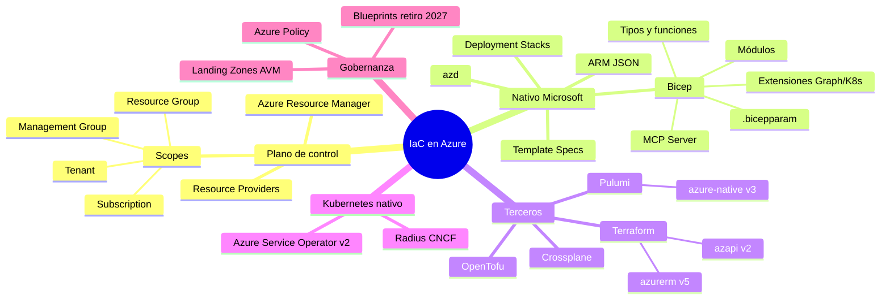

# Infraestructura como Código (IaC) en Azure — Investigación con foco en Bicep

> **Fecha de corte de la investigación:** 1 de octubre de 2026
> **Versión de Bicep verificada:** `v0.47.16` (8 sep 2026) — los ejemplos de esta carpeta fueron compilados y validados con ese binario (`bicep build`, `bicep lint`, `bicep build-params`).
> **Idioma:** español. Los nombres de comandos, APIs y propiedades se mantienen en inglés porque así aparecen en la documentación oficial.

---

## 1. Resumen ejecutivo

- **Azure Resource Manager (ARM)** es el plano de control único de Azure: *todas* las herramientas de IaC (Bicep, ARM JSON, Terraform, Pulumi, OpenTofu, Crossplane, ASO…) terminan llamando a la API REST de ARM.
- **Bicep** es el DSL declarativo nativo de Microsoft para Azure. Compila (transpila) a plantillas ARM JSON (`languageVersion: 2.0` cuando se usan tipos/funciones definidos por el usuario), **no guarda estado propio** (el "estado" es Azure mismo) y tiene soporte *día 0* para cualquier tipo de recurso y `apiVersion`, incluso en preview.
- En 2025-2026 Bicep maduró en cuatro frentes: **tipado fuerte** (user-defined types, funciones, `import/export`), **ciclo de vida** (Deployment Stacks como sucesor de Azure Blueprints), **ecosistema de módulos** (Azure Verified Modules, ~170 módulos de recurso publicados) y **tooling para IA** (Bicep MCP Server, `bicep console`, `bicep snapshot`).
- **Azure Blueprints se retira el 31 de enero de 2027** (fecha extendida; originalmente 11 jul 2026). El reemplazo oficial es **Template Specs (o Git) + Deployment Stacks**.
- La alternativa principal es **Terraform** (`azurerm` v5.x desde jul 2026 + `azapi` v2.x), con **OpenTofu** como fork abierto (licencia MPL) y **Pulumi** para quien quiere lenguajes de propósito general. **CDK for Terraform fue archivado el 10 dic 2025.**

## 2. Mapa de documentos

| # | Archivo | Contenido |
|---|---------|-----------|
| 01 | [`01-contexto-iac-azure.md`](01-contexto-iac-azure.md) | Qué es IaC, historia de IaC en Azure, conceptos ARM (scopes, modos, idempotencia), línea de tiempo |
| 02 | [`02-arquitectura-arm-bicep.md`](02-arquitectura-arm-bicep.md) | Arquitectura interna: compilador, ARM, resource providers, flujo de despliegue, what-if, límites |
| 03 | [`03-bicep-lenguaje.md`](03-bicep-lenguaje.md) | Referencia del lenguaje: tipos, decoradores, funciones, bucles, condiciones, `existing`, módulos, `.bicepparam`, extensiones |
| 04 | [`04-bicep-versiones-tooling.md`](04-bicep-versiones-tooling.md) | Historial de versiones 2025-2026, features GA vs experimentales, CLI, VS Code, MCP Server, `bicepconfig.json`, linter |
| 05 | [`05-modulos-avm-registros.md`](05-modulos-avm-registros.md) | Módulos locales, registro privado (ACR), Template Specs, Azure Verified Modules |
| 06 | [`06-deployment-stacks-gobernanza.md`](06-deployment-stacks-gobernanza.md) | Deployment Stacks, deny settings, retiro de Blueprints, Azure Policy, Landing Zones |
| 07 | [`07-cicd-bicep.md`](07-cicd-bicep.md) | GitHub Actions (OIDC + `azure/bicep-deploy@v2`), Azure Pipelines, gates con what-if |
| 08 | [`08-alternativas-iac-azure.md`](08-alternativas-iac-azure.md) | ARM JSON, Terraform/AzureRM/AzAPI, OpenTofu, Pulumi, CDKTF, azd, Radius, ASO, Crossplane — comparativas |
| 09 | [`09-ejemplo-completo.md`](09-ejemplo-completo.md) | Proyecto de referencia explicado archivo por archivo (código en `ejemplos/bicep-app/`) |
| 10 | [`10-buenas-practicas-antipatrones.md`](10-buenas-practicas-antipatrones.md) | Checklist de buenas prácticas, anti-patrones, troubleshooting |
| 11 | [`11-fuentes.md`](11-fuentes.md) | Todas las fuentes consultadas |

## 3. Mapa mental del dominio



## 4. Estructura de esta carpeta

```text
iac-azure-bicep/
├── 00-README.md                     ← estás aquí
├── 01-contexto-iac-azure.md
├── 02-arquitectura-arm-bicep.md
├── 03-bicep-lenguaje.md
├── 04-bicep-versiones-tooling.md
├── 05-modulos-avm-registros.md
├── 06-deployment-stacks-gobernanza.md
├── 07-cicd-bicep.md
├── 08-alternativas-iac-azure.md
├── 09-ejemplo-completo.md
├── 10-buenas-practicas-antipatrones.md
├── 11-fuentes.md
└── ejemplos/bicep-app/              ← código compilable (Bicep 0.47.16)
    ├── bicepconfig.json
    ├── main.bicep                   (scope: subscription)
    ├── main.avm.bicep               (variante con Azure Verified Modules)
    ├── shared/types.bicep           (tipos + funciones exportadas)
    ├── modules/
    │   ├── monitoring.bicep
    │   ├── identity.bicep
    │   ├── keyvault.bicep
    │   └── containerapp.bicep
    ├── params/
    │   ├── base.bicepparam          (using none)
    │   ├── main.dev.bicepparam      (extends base)
    │   └── main.prod.bicepparam     (extends base)
    └── .github/workflows/infra.yml  (CI/CD con OIDC + deployment stacks)
```

## 5. Metodología y límites

1. Toda cifra, fecha o versión proviene de documentación oficial (Microsoft Learn, GitHub releases de Azure/HashiCorp/OpenTofu/Pulumi, MCR) consultada el 1 oct 2026. Ver [`11-fuentes.md`](11-fuentes.md).
2. El código Bicep de `ejemplos/bicep-app` (excepto `main.avm.bicep`) se compiló con Bicep CLI `0.47.16` sin errores ni warnings de linter.
3. `main.avm.bicep` **no** pudo restaurarse en el entorno de verificación (sin acceso de red a `mcr.microsoft.com`); las versiones de módulos sí se confirmaron consultando el endpoint de tags de MCR.
4. Las funciones marcadas como **experimentales** requieren `experimentalFeaturesEnabled` en `bicepconfig.json` y **no tienen soporte de Microsoft Support**.
5. Nada aquí se desplegó contra una suscripción real: valida con `what-if` antes de usarlo.
