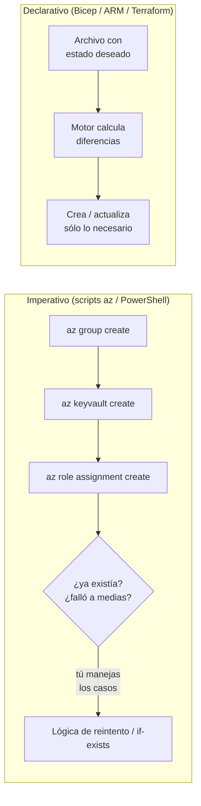
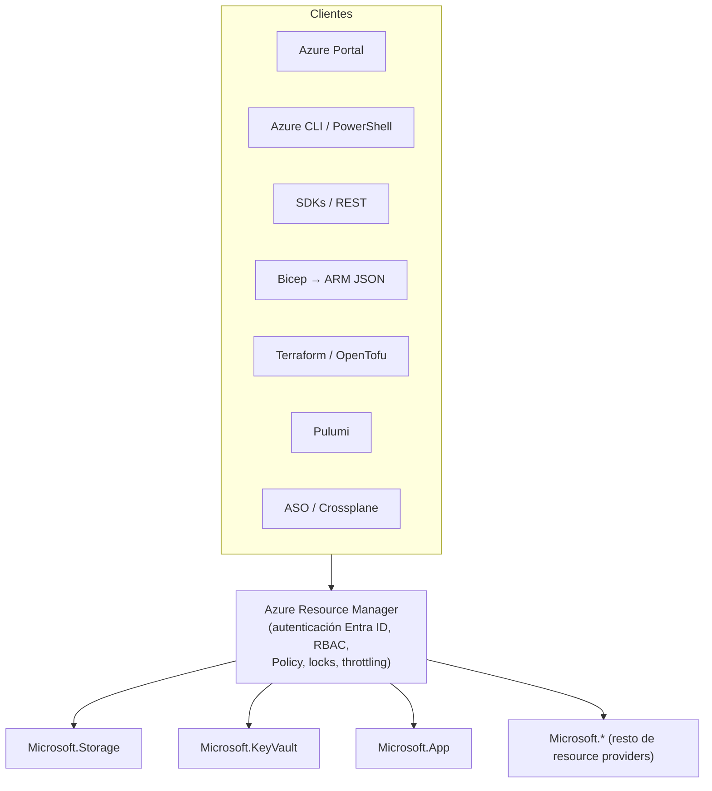
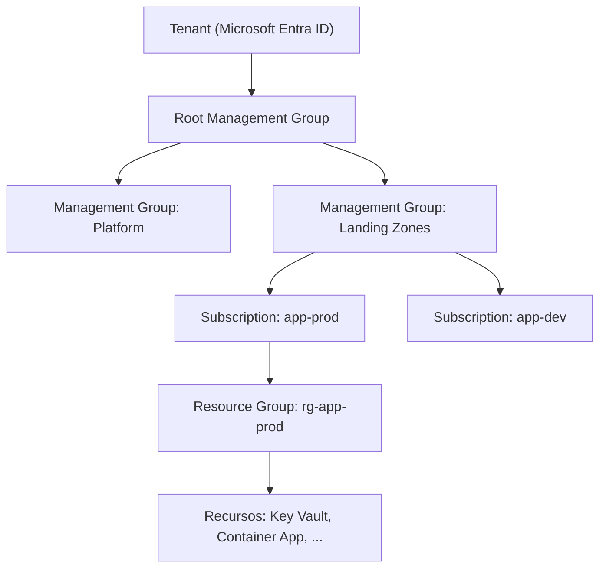
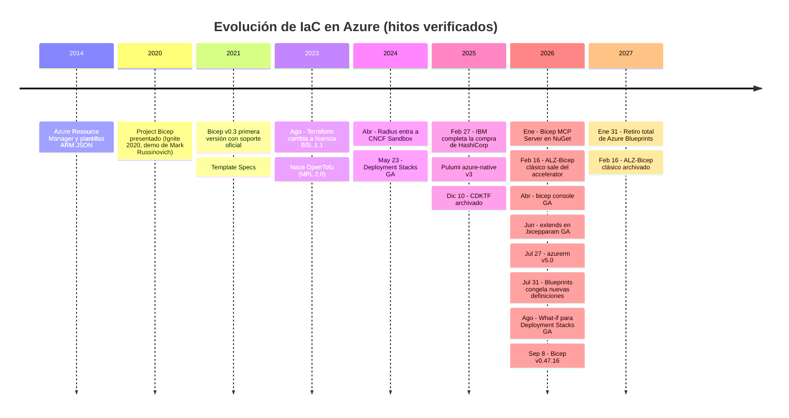
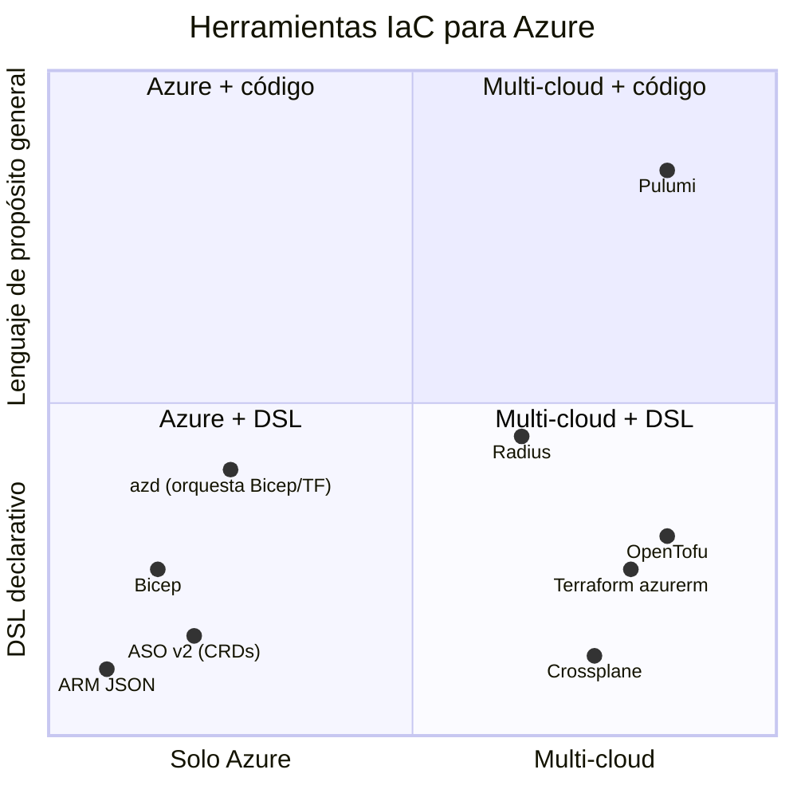

# 01 · Contexto: Infraestructura como Código en Azure

## 1. ¿Qué es IaC y por qué importa?

**Infraestructura como Código (IaC)** es la práctica de describir la infraestructura (redes, cómputo, bases de datos, identidades, políticas) en archivos de texto versionables, revisables y ejecutables, en lugar de crearla a mano desde un portal.

| Propiedad | Qué significa en la práctica |
|-----------|------------------------------|
| **Declarativa** | Describes el *estado deseado* ("quiero un Key Vault con RBAC"), no los pasos ("crea, luego configura, luego…"). |
| **Idempotente** | Aplicar el mismo archivo N veces produce el mismo resultado; la segunda ejecución no duplica recursos. |
| **Versionable** | Vive en Git: historial, PRs, revisión por pares, rollback por commit. |
| **Reproducible** | Los entornos dev/qa/prod salen del mismo código con parámetros distintos. |
| **Auditable** | Cada cambio tiene autor, fecha y motivo (commit + pipeline). |
| **Testeable** | Linter, validación preflight, *what-if*/plan, policy-as-code antes de tocar producción. |

### Imperativo vs declarativo

## 2. El plano de control: Azure Resource Manager (ARM)

Todo en Azure pasa por **Azure Resource Manager**, el servicio de despliegue y administración. Portal, Azure CLI, PowerShell, SDKs, REST, Bicep, Terraform y Pulumi son **clientes** de la misma API de ARM. Por eso:

- Las mismas reglas de **RBAC**, **Azure Policy**, **locks** y **límites** aplican a cualquier herramienta.
- Una herramienta de IaC es, en esencia, una forma distinta de *producir llamadas a ARM*.

### 2.1 Jerarquía de scopes (ámbitos)

| Scope | `targetScope` en Bicep | Comando CLI de despliegue | Casos típicos |
|-------|------------------------|---------------------------|---------------|
| Resource group | `resourceGroup` (por defecto) | `az deployment group create` | Workloads, la mayoría de recursos |
| Subscription | `subscription` | `az deployment sub create` | Crear RGs, policy/role assignments, budgets |
| Management group | `managementGroup` | `az deployment mg create` | Policy definitions/assignments de organización |
| Tenant | `tenant` | `az deployment tenant create` | Crear management groups, suscripciones (EA/MCA) |

### 2.2 Modos de despliegue

| Modo | Comportamiento | Riesgo |
|------|----------------|--------|
| **Incremental** (por defecto) | Crea/actualiza lo declarado. Lo que existe en el RG y **no** está en la plantilla se deja intacto. | Deriva (drift) y "basura" acumulada. |
| **Complete** | Elimina del RG lo que no está en la plantilla. Sólo a nivel de resource group. | Borrados accidentales. Microsoft recomienda **Deployment Stacks** en su lugar. |

> **Importante sobre el modo incremental:** ARM aplica las propiedades del recurso *como un todo* (PUT). Si omites una propiedad en la plantilla, el resource provider puede resetearla a su valor por defecto. "Incremental" se refiere a qué **recursos** se tocan, no a un *merge* de propiedades.

### 2.3 ¿Y el estado?

- **Bicep/ARM no tiene archivo de estado.** El estado real es lo que existe en Azure. ARM guarda un **historial de deployments** (máx. 800 por scope, se purgan automáticamente).
- **Terraform/OpenTofu/Pulumi** mantienen un **state file** (local o remoto: Azure Storage, HCP Terraform, Pulumi Cloud…) que mapea el código con los IDs reales.
- **Deployment Stacks** añaden a ARM una noción de "conjunto de recursos administrados", lo más parecido a estado que tiene el mundo nativo — sin archivo que custodiar.

## 3. Línea de tiempo de IaC en Azure

## 4. Familias de herramientas IaC para Azure

| Familia | Herramientas | Cuándo encaja |
|---------|--------------|---------------|
| **Nativo Azure (DSL)** | ARM JSON, **Bicep**, Template Specs, Deployment Stacks | 100 % Azure, soporte día 0, sin estado que custodiar, integración con Policy/portal |
| **Multi-cloud (DSL)** | Terraform (HCL), OpenTofu | Varias nubes/SaaS (GitHub, Datadog, Cloudflare…), equipos ya invertidos en HCL |
| **Lenguajes generales** | Pulumi (TS, Python, Go, C#, Java, YAML) | Equipos de software que quieren tests unitarios, abstracciones OOP, loops reales |
| **Kubernetes-native** | Azure Service Operator v2, Crossplane | GitOps (Flux/Argo CD) donde todo se declara como CRD |
| **Plataforma de aplicaciones** | azd, Radius | Experiencia "dev-first": app + infra con un comando; recetas para platform engineering |

## 5. Vocabulario esencial

| Término | Definición |
|---------|-----------|
| **Resource provider (RP)** | Servicio que implementa un tipo de recurso, p. ej. `Microsoft.KeyVault`. Debe estar *registrado* en la suscripción. |
| **Resource type + apiVersion** | `Microsoft.KeyVault/vaults@2024-11-01`. La versión de API define el esquema de propiedades. |
| **Deployment** | Recurso `Microsoft.Resources/deployments`: una ejecución de plantilla con su resultado e historial. |
| **Nested / linked deployment** | Un deployment dentro de otro. En Bicep cada `module` se convierte en un deployment anidado. |
| **Preflight validation** | Validación que ARM hace antes de crear nada (sintaxis, cuotas, Policy con efecto `deny`, permisos). |
| **What-if** | Previsualización de cambios (equivalente a `terraform plan`). |
| **Template Spec** | Recurso de Azure que almacena una plantilla versionada y compartible con RBAC. |
| **Deployment Stack** | Recurso que agrupa y gobierna el ciclo de vida de los recursos de una plantilla (borrar/desvincular lo que sale, deny assignments). |
| **AVM** | Azure Verified Modules: módulos oficiales Bicep/Terraform mantenidos por Microsoft. |
| **Drift** | Diferencia entre lo declarado en código y lo real en Azure (por cambios manuales). |

---
➡️ Siguiente: [02 · Arquitectura ARM + Bicep](02-arquitectura-arm-bicep.md)
