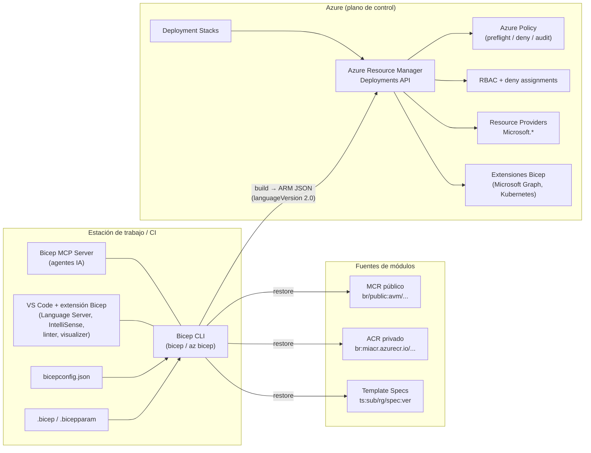
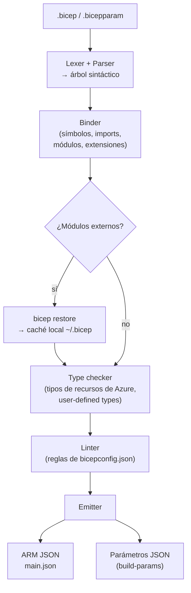
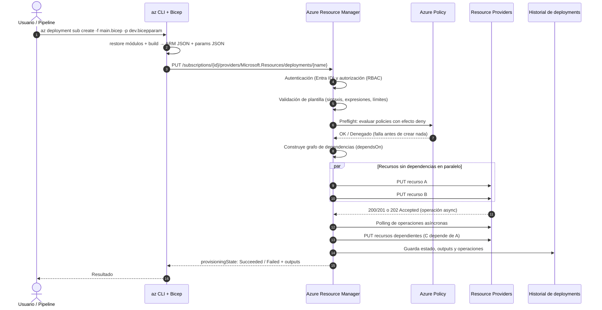
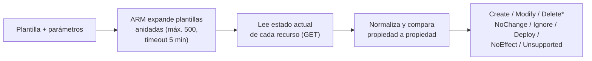
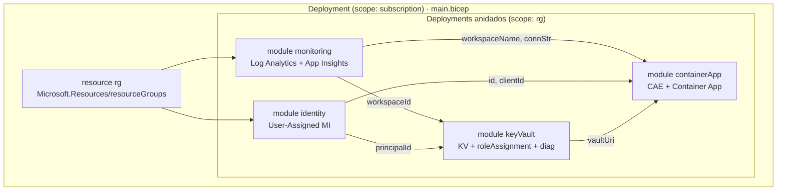
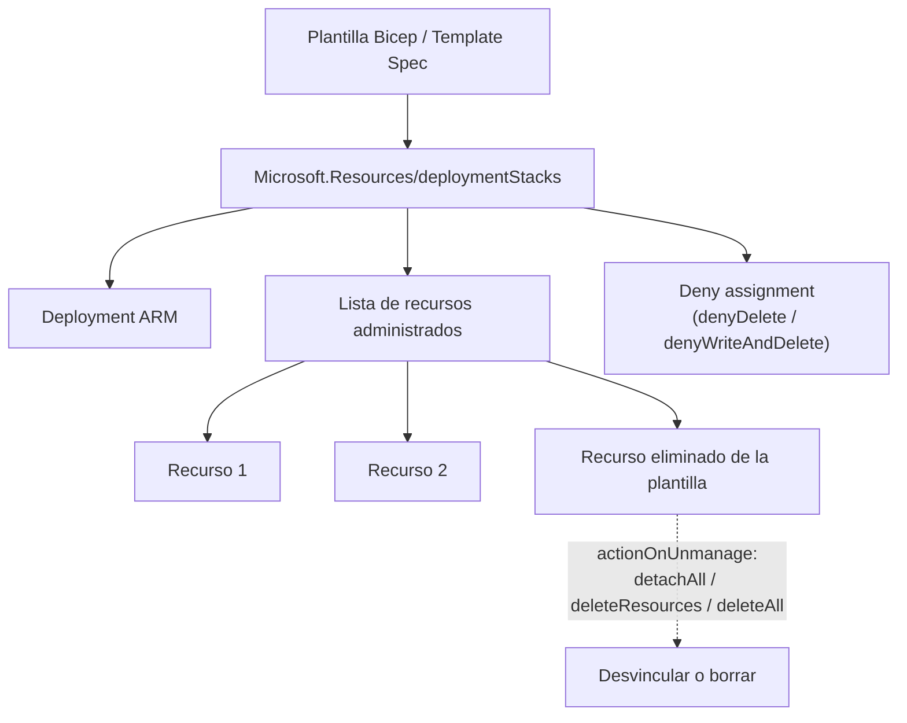
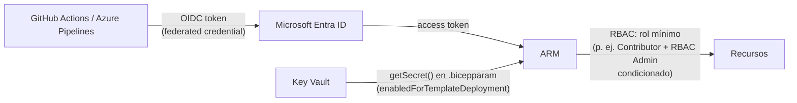

# 02 · Arquitectura: cómo funciona Bicep sobre Azure Resource Manager

## 1. Vista general de componentes



**Idea clave:** Bicep es un *transpilador*. La extensión, el CLI y el MCP server comparten el mismo compilador (.NET; desde Bicep 0.41 sobre **.NET 10**). Azure nunca "ve" Bicep: recibe una plantilla ARM JSON. La única excepción práctica es que `az`/PowerShell compilan por ti de forma transparente al pasar un `.bicep` o `.bicepparam`.

## 2. Pipeline de compilación



- **Type checker:** Bicep trae embebidos los esquemas de tipos (`bicep-types-az`) generados desde las especificaciones REST de Azure. Si usas una `apiVersion` que no conoce, emite el warning `BCP081` pero **compila igual** (por eso el soporte es "día 0").
- **Linter:** se ejecuta en el editor y en `bicep lint`/`bicep build`. Las reglas se configuran por nivel (`off`, `info`, `warning`, `error`).

### 2.1 Qué produce el compilador (ejemplo real)

El `main.bicep` del ejemplo (≈115 líneas + 4 módulos + tipos, ≈450 líneas en total) genera **≈1 080 líneas / 35 KB** de ARM JSON. Extracto del resultado real compilado con 0.47.16:

```json
{
  "$schema": "https://schema.management.azure.com/schemas/2018-05-01/subscriptionDeploymentTemplate.json#",
  "languageVersion": "2.0",
  "contentVersion": "1.0.0.0",
  "metadata": {
    "_generator": { "name": "bicep", "version": "0.47.16.16243" },
    "name": "Demo app en Azure Container Apps"
  },
  "definitions": { "containerAppConfigType": {}, "environmentType": {}, "tagsType": {} },
  "functions": [ { "namespace": "__bicep", "members": { "compactName": {}, "resourceName": {} } } ],
  "resources": {
    "rg":           { "type": "Microsoft.Resources/resourceGroups", "apiVersion": "2025-04-01" },
    "monitoring":   { "type": "Microsoft.Resources/deployments", "dependsOn": ["rg"] },
    "identity":     { "type": "Microsoft.Resources/deployments", "dependsOn": ["rg"] },
    "keyVault":     { "type": "Microsoft.Resources/deployments", "dependsOn": ["identity", "monitoring", "rg"] },
    "containerApp": { "type": "Microsoft.Resources/deployments", "dependsOn": ["identity", "keyVault", "monitoring", "rg"] }
  }
}
```

Observa:

1. **`languageVersion: "2.0"`** → `resources` es un **objeto con nombres simbólicos** (no un array). Bicep lo emite automáticamente cuando usas tipos definidos por el usuario, `existing` con ciertas features, extensiones, etc.
2. **`definitions`** y **`functions`** → los `type` y `func` de Bicep se trasladan al ARM JSON.
3. **Cada `module` es un `Microsoft.Resources/deployments`** (deployment anidado) con `expressionEvaluationOptions.scope = inner`.
4. **`dependsOn` lo calcula Bicep** a partir de las referencias simbólicas (`identity.outputs.principalId` ⇒ depende de `identity`). Nunca lo escribiste a mano.
5. El nombre del deployment de un módulo es opcional; si lo omites, Bicep genera `'<simbolo>-<uniqueString(...)>'`.

## 3. Flujo de un despliegue de extremo a extremo



Puntos relevantes:

- **Paralelismo:** ARM despliega en paralelo todo lo que no tiene dependencias entre sí. Para forzar serialización en bucles se usa `@batchSize(n)`.
- **Reintentos:** desde Bicep 0.45.6 el decorador **`@retryOn([...códigos], n)`** está GA para reintentar un recurso ante códigos de error transitorios concretos.
- **Sin rollback transaccional:** si un recurso falla, los ya creados quedan. Existe `--rollback-on-error` (vuelve al último deployment exitoso, sólo a nivel RG), pero lo usual es corregir y redesplegar (idempotencia).

## 4. What-if: previsualización de cambios



| Comando | Scope |
|---------|-------|
| `az deployment group what-if` | Resource group |
| `az deployment sub what-if` | Subscription |
| `az deployment mg what-if` | Management group |
| `az deployment tenant what-if` | Tenant |
| `az deployment group create --confirm-with-what-if` (`-c`) | Muestra what-if y pide confirmación |
| `az stack-whatif group/sub/mg create` | What-if para **Deployment Stacks** (GA, ago 2026) |

Opciones útiles:

- `--result-format FullResourcePayloads | ResourceIdOnly`
- `--exclude-change-types Ignore NoChange`
- `--validation-level Provider | ProviderNoRbac | Template` (Azure CLI ≥ 2.76.0). `ProviderNoRbac` permite correr what-if con permisos de **solo lectura** — ideal para PRs.
- `--no-pretty-print` para obtener JSON y procesarlo en el pipeline.

**Limitaciones conocidas:** ruido en propiedades con valores por defecto del servidor, recursos referenciados con `templateLink` no se evalúan, `Delete` sólo aparece en modo *complete* (o en stacks con `actionOnUnmanage` de borrado), y si se superan 500 plantillas anidadas u 800 RGs los recursos salen como `Ignore`.

## 5. Arquitectura de módulos y scopes cruzados

Un archivo con `targetScope = 'subscription'` puede crear un RG y desplegar módulos *dentro* de él con `scope: rg`. ARM lo implementa como deployments anidados en distintos scopes:



Funciones de scope disponibles: `resourceGroup('nombre')`, `resourceGroup('subId','nombre')`, `subscription('id')`, `managementGroup('id')`, `tenant()`. Los recursos de **extensión** (role assignments, locks, diagnostic settings, policy assignments) usan la propiedad `scope: <recurso>` para aplicarse sobre otro recurso.

## 6. Arquitectura de Deployment Stacks (resumen)



Detalle completo en [06 · Deployment Stacks y gobernanza](06-deployment-stacks-gobernanza.md).

## 7. Límites de plataforma que afectan al diseño

| Límite (ARM) | Valor |
|--------------|-------|
| Parámetros por plantilla | 256 |
| Variables por plantilla | 256 |
| Recursos por plantilla (incluye `copy`) | 800 |
| Outputs por plantilla | 64 |
| Longitud de una expresión | 24 576 caracteres |
| Tamaño de plantilla compilada | 4 MB |
| Tamaño de una definición de recurso | 1 MB |
| Tamaño de archivo de parámetros | 4 MB |
| Tamaño de request a la API de ARM | 4 194 304 bytes |
| Historial de deployments por RG / suscripción / MG | 800 (purga automática) |
| Recursos en una plantilla exportada desde portal | 200 |
| What-if: plantillas anidadas | 500 |

**Implicaciones de diseño:** combina parámetros en objetos tipados (para no llegar a 256), divide grandes plataformas en varios deployments/stacks, y vigila el tamaño cuando inyectas archivos con `loadTextContent()`/`loadFileAsBase64()`.

## 8. Seguridad del flujo



- **Parámetros `@secure()`** no se registran en el historial ni en logs del deployment.
- **Nunca** pongas secretos en outputs (regla de linter `outputs-should-not-contain-secrets`).
- Usa **`getSecret()`** en `.bicepparam` para leer de Key Vault en tiempo de despliegue.
- Prefiere **OIDC / workload identity federation** sobre client secrets en CI/CD.

---
⬅️ [01 · Contexto](01-contexto-iac-azure.md) · ➡️ [03 · Lenguaje Bicep](03-bicep-lenguaje.md)
