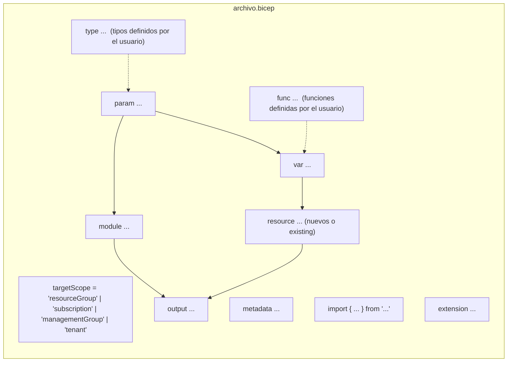

# 03 · Bicep: referencia del lenguaje (con ejemplos verificados)

> Todos los fragmentos de este documento se compilaron con **Bicep CLI 0.47.16**. Los que dependen de registros externos (AVM, Microsoft Graph) se indican explícitamente.

## 1. Anatomía de un archivo `.bicep`

Los elementos pueden aparecer **en cualquier orden** (a diferencia de ARM JSON, que tiene secciones fijas).



| Elemento | Sintaxis mínima | Notas |
|----------|----------------|-------|
| Scope | `targetScope = 'subscription'` | Por defecto `resourceGroup` |
| Metadata | `metadata description = '...'` | Libre; se emite al JSON |
| Parámetro | `param location string = resourceGroup().location` | Tipado; admite decoradores |
| Variable | `var prefix = 'app'` | Tipo inferido o explícito (`var x int = 1`) |
| Tipo | `type sku = 'S1' \| 'P1v3'` | Unión de literales, objetos, arrays, nullables |
| Función | `func f(a string) string => '${a}-x'` | Pura; no puede referenciar recursos ni params |
| Recurso | `resource sa 'Microsoft.Storage/storageAccounts@2025-06-01' = { ... }` | Nombre simbólico + tipo@apiVersion |
| Módulo | `module m 'mod.bicep' = { params: { } }` | Local, `br:`, `br/public:`, `ts:` |
| Output | `output id string = sa.id` | Máx. 64 por plantilla |
| Import | `import { t } from 'shared.bicep'` / `import * as s from ...` | Requiere `@export()` en origen |
| Extensión | `extension graphV1` / `extension kubernetes with {...} as k8s` | Recursos fuera de ARM |

## 2. Tipos de datos

| Tipo | Ejemplo | Comentario |
|------|---------|------------|
| `string` | `'hola'`, `'''multi-línea'''` | Comillas simples; interpolación `'${x}'` |
| `int` | `42` | 64 bits |
| `bool` | `true` | |
| `array` | `[1, 'a', true]` | Puede ser tipado: `string[]`, `int[]` |
| `object` | `{ a: 1, 'b-c': 2 }` | Claves con guion entre comillas |
| `null` | `null` | Útil para omitir propiedades |
| Literales / uniones | `'dev' \| 'prod'` | Validación en compilación |
| Nullable | `string?` | Parámetro opcional sin default |
| Secure | `@secure() param p string` | Sólo `string` y `object` |
| Derivados de recurso | `resourceInput<'Microsoft.Storage/storageAccounts@2025-06-01'>.properties` | Reutiliza el esquema de Azure como tipo |

### 2.1 Tipos definidos por el usuario (UDT)

```bicep
@export()
type environmentType = 'dev' | 'qa' | 'prod'

@export()
@sealed()                       // propiedades extra = error (no sólo warning)
type tagsType = {
  environment: environmentType
  owner: string
  costCenter: string
  project: string
}

// Objeto con propiedades opcionales y "additional properties" tipadas
type cfgType = {
  name: string
  sku: ('Standard_LRS' | 'Standard_ZRS')?   // opcional
  *: string                                // resto de claves: string
}

// Unión etiquetada (tagged union) con discriminador
@discriminator('kind')
type petType = { kind: 'cat', lives: int } | { kind: 'dog', breed: string }

// Diccionario: cualquier clave, valores string
type envVars = { *: string }

// Reutilizar el esquema real de un recurso como tipo de parámetro
param stgProps resourceInput<'Microsoft.Storage/storageAccounts@2025-06-01'>.properties = {
  minimumTlsVersion: 'TLS1_2'
}
```

### 2.2 Funciones definidas por el usuario (UDF)

```bicep
@export()
func resourceName(abbreviation string, workload string, env environmentType, location string) string =>
  toLower('${abbreviation}-${workload}-${env}-${location}')

@export()
func compactName(abbreviation string, workload string, env environmentType, seed string) string =>
  take(toLower('${abbreviation}${replace(workload, '-', '')}${env}${uniqueString(seed)}'), 24)
```

Restricciones: no pueden acceder a parámetros/variables del archivo, ni a recursos; sí pueden llamar a otras UDF y a funciones built-in. Se compilan a la sección `functions` del ARM JSON (namespace `__bicep`).

### 2.3 Import / export

```bicep
// En shared/types.bicep: marcar con @export()
// En el consumidor:
import { environmentType, tagsType, resourceName } from 'shared/types.bicep'
import * as shared from 'shared/types.bicep'          // namespace completo
import { tagsType as corpTags } from 'br:miacr.azurecr.io/bicep/types:1.0'  // desde registro
```

## 3. Decoradores

| Decorador | Aplica a | Ejemplo |
|-----------|---------|---------|
| `@description('...')` | todo | Documentación; aparece en IntelliSense y en `bicep docs generate` |
| `@metadata({...})` | todo | Metadatos arbitrarios |
| `@allowed([...])` | param | Lista cerrada (preferir tipos unión) |
| `@minLength(n)` / `@maxLength(n)` | string, array | |
| `@minValue(n)` / `@maxValue(n)` | int | |
| `@secure()` | param, output, tipo | No se registra en logs/historial |
| `@sealed()` | tipo/param objeto | Propiedades no declaradas = error |
| `@discriminator('prop')` | tipo unión | Uniones etiquetadas |
| `@export()` | type, var, func | Habilita `import` |
| `@batchSize(n)` | resource/module con `for` | Serializa en lotes de n |
| `@retryOn([...], n)` | resource | **GA desde 0.45.6**: reintenta ante códigos de error |
| `@onlyIfNotExists()` | resource | Sólo crea si no existe (no actualiza) |
| `@nullIfNotFound()` | resource `existing` | **GA desde 0.44.1**: devuelve `null` si no existe |

```bicep
@retryOn(['ResourceNotFound'], 3)
resource la 'Microsoft.OperationalInsights/workspaces@2025-07-01' = {
  name: 'log-demo'
  location: location
}

@nullIfNotFound()
resource maybeKv 'Microsoft.KeyVault/vaults@2024-11-01' existing = {
  name: 'kv-quizas'
}
output maybeKvExists bool = maybeKv != null
```

## 4. Recursos

### 4.1 Declaración básica, `parent` e hijos anidados

```bicep
resource kv 'Microsoft.KeyVault/vaults@2024-11-01' = {
  name: keyVaultName
  location: location
  properties: {
    tenantId: subscription().tenantId
    sku: { family: 'A', name: 'standard' }
    enableRbacAuthorization: true
  }

  // Hijo anidado: tipo relativo, sin repetir el padre
  resource secret 'secrets' = {
    name: 'mi-secreto'
    properties: { value: secretValue }
  }
}

// Alternativa: hijo con "parent"
resource secret2 'Microsoft.KeyVault/vaults/secrets@2024-11-01' = {
  parent: kv
  name: 'otro-secreto'
  properties: { value: secretValue }
}

// Acceso a un hijo anidado desde fuera:  kv::secret.id
```

### 4.2 Recursos existentes (`existing`)

```bicep
resource law 'Microsoft.OperationalInsights/workspaces@2025-07-01' existing = {
  name: workspaceName
  scope: resourceGroup(otherSubId, 'rg-monitoring')   // opcional: otro scope
}

// Lectura de propiedades y funciones list*
var customerId = law.properties.customerId
var sharedKey  = law.listKeys().primarySharedKey
```

### 4.3 Recursos de extensión (`scope:`)

Role assignments, locks, diagnostic settings y policy assignments se "cuelgan" de otro recurso:

```bicep
resource kvSecretsUser 'Microsoft.Authorization/roleAssignments@2022-04-01' = {
  name: guid(kv.id, principalId, 'Key Vault Secrets User')   // nombre determinista = idempotente
  scope: kv
  properties: {
    roleDefinitionId: roleDefinitions('Key Vault Secrets User').id  // función nueva (0.42.1)
    principalId: principalId
    principalType: 'ServicePrincipal'
  }
}

resource lock 'Microsoft.Authorization/locks@2020-05-01' = {
  name: 'no-delete'
  scope: kv
  properties: { level: 'CanNotDelete' }
}
```

### 4.4 Existencia del propio recurso: `this.exists()`

GA desde 0.44.1. Útil para preservar valores que sólo se pueden fijar una vez:

```bicep
resource kv 'Microsoft.KeyVault/vaults@2024-11-01' = {
  name: 'kv-x'
  location: location
  properties: {
    tenantId: tenant().tenantId
    sku: { family: 'A', name: 'standard' }
    enablePurgeProtection: this.exists() ? this.existingResource().?properties.?enablePurgeProtection : null
  }
}
```

## 5. Expresiones

### 5.1 Condiciones

```bicep
resource diag 'Microsoft.Insights/diagnosticSettings@2021-05-01-preview' = if (enableDiag) { ... }

var retention = environment == 'prod' ? 90 : 30
```

### 5.2 Bucles `for`

```bicep
param names array = ['a', 'b', 'c']

@batchSize(2)
resource stgs 'Microsoft.Storage/storageAccounts@2025-06-01' = [for (n, i) in names: {
  name: 'st${n}${i}${uniqueString(resourceGroup().id)}'
  location: location
  sku: { name: 'Standard_LRS' }
  kind: 'StorageV2'
}]

// Bucle con filtro
module mods 'm.bicep' = [for r in regions: if (r.enabled) { scope: resourceGroup(r.rg), params: { ... } }]

// Bucle sobre rango y sobre objetos
var idx = [for i in range(0, 3): 'item-${i}']
var kv  = [for item in items({ a: 1, b: 2 }): '${item.key}=${item.value}']

// Outputs desde bucles
output stgIds array = [for (n, i) in names: stgs[i].id]
```

### 5.3 Lambdas y funciones de orden superior

```bicep
var nums    = [1, 2, 3, 4]
var doubled = map(nums, n => n * 2)                 // [2,4,6,8]
var evens   = filter(nums, n => n % 2 == 0)         // [2,4]
var total   = reduce(nums, 0, (acc, n) => acc + n)  // 10
var byKey   = toObject(names, n => n, n => length(n))
// También: sort, groupBy, mapValues, objectKeys, shallowMerge, flatten
```

### 5.4 Operadores modernos

```bicep
var merged  = { ...{ a: 1 }, b: 2 }      // spread en objetos
var arr     = [...nums, 5]               // spread en arrays
var skuSafe = cfg.?sku ?? 'Standard_LRS' // safe-dereference + coalesce
var dist    = distinct([1, 1, 2])        // nuevo en 0.43.1
var isMatch = like('rg-app-prod', 'rg-*-prod')  // comodines, nuevo en 0.43.1

// Strings multilínea con interpolación (GA en 0.40.2)
var multi = $'''
Ubicación: ${location}
Total: ${total}
'''
```

### 5.5 Funciones built-in más usadas

| Categoría | Funciones |
|-----------|-----------|
| Scope / despliegue | `resourceGroup()`, `subscription()`, `tenant()`, `managementGroup()`, `deployment()`, `environment()`, `deployer()` |
| IDs | `resourceId()`, `subscriptionResourceId()`, `tenantResourceId()`, `extensionResourceId()`, `roleDefinitions('Nombre')` |
| Strings | `uniqueString()`, `guid()`, `format()`, `toLower()`, `replace()`, `take()`, `split()`, `startsWith()`, `like()` |
| Colecciones | `union()`, `intersection()`, `contains()`, `empty()`, `length()`, `items()`, `range()`, `distinct()` |
| Archivos (compilación) | `loadTextContent()`, `loadJsonContent()`, `loadYamlContent()`, `loadFileAsBase64()` |
| Otros | `json()`, `base64()`, `dateTimeAdd()`, `utcNow()` (sólo como default de param), `fail()`, `getSecret()` (sólo en `.bicepparam` y params de módulo) |

## 6. Módulos

```bicep
// Local
module monitoring 'modules/monitoring.bicep' = {
  scope: rg                 // opcional; por defecto el scope actual
  params: { location: location, workspaceName: names.law, tags: tags }
}

// Registro público (AVM)
module kv 'br/public:avm/res/key-vault/vault:0.14.2' = {
  params: { name: kvName, enableRbacAuthorization: true }
}

// Registro privado (alias definido en bicepconfig.json)
module st 'br/corp:storage:2.1.0' = { params: { ... } }

// Template Spec
module net 'ts/corpSpecs:network-hub:1.0' = { params: { ... } }

// Uso de outputs → dependencia implícita
var uri = kv.outputs.uri
```

> El campo `name:` de un módulo es **opcional** (Bicep genera uno único). Ponlo explícito si quieres nombres de deployment legibles en el portal.

## 7. Archivos de parámetros `.bicepparam`

Disponibles desde Bicep 0.18.4 / Azure CLI 2.47.0. Se compilan con `bicep build-params`.

```bicep
// params/base.bicepparam
using none                       // no atado a una plantilla (0.31+)
param workload = 'demo'
param appConfig = { image: 'mcr.microsoft.com/k8se/quickstart:latest', minReplicas: 0, maxReplicas: 3, cpu: '0.25', memory: '0.5Gi', targetPort: 80 }
```

```bicep
// params/main.dev.bicepparam
using '../main.bicep'
extends 'base.bicepparam'        // GA en 0.44.1; heredados opcionales desde 0.45.6

param environment = 'dev'
param tags = { environment: 'dev', owner: 'keniding', costCenter: 'CC-0001', project: 'iac-bicep-demo' }
param sampleSecretValue = readEnvironmentVariable('SAMPLE_SECRET', '')
```

```bicep
// Secretos desde Key Vault (el vault necesita enabledForTemplateDeployment = true)
param dbPassword = getSecret('<subscriptionId>', '<rg>', '<kvName>', 'db-password')
```

Comandos:

```bash
az deployment group create -g rg-demo -p params/main.dev.bicepparam            # el using indica la plantilla
az deployment group create -g rg-demo -p params/main.dev.bicepparam -p workload=otro   # override inline
bicep build-params params/main.dev.bicepparam --stdout                          # ver JSON resultante
bicep generate-params main.bicep --output-format bicepparam --include-params all
bicep decompile-params azuredeploy.parameters.json --bicep-file main.bicep
```

## 8. Extensiones (recursos fuera de ARM)

### 8.1 Microsoft Graph (GA) — Entra ID como código

`bicepconfig.json`:

```json
{
  "extensions": {
    "graphV1": "br:mcr.microsoft.com/bicep/extensions/microsoftgraph/v1.0:1.0.0"
  }
}
```

`.bicep` (no verificado localmente: requiere descargar la extensión de MCR):

```bicep
extension graphV1

resource app 'Microsoft.Graph/applications@v1.0' = {
  uniqueName: 'app-demo'          // clave idempotente en Graph
  displayName: 'App Demo'
}

resource sp 'Microsoft.Graph/servicePrincipals@v1.0' = {
  appId: app.appId
}

resource grp 'Microsoft.Graph/groups@v1.0' existing = {
  uniqueName: 'grp-platform-admins'
}
```

- Versiones de la extensión en MCR (oct 2026): `0.1.8-preview`, `0.1.9-preview`, `0.2.0-preview`, **`1.0.0`**. Existe también la variante `beta`.
- Cubre recursos de **Microsoft Entra ID** (applications, service principals, groups, federated identity credentials, app role assignments…), no todo Graph.

### 8.2 Kubernetes (preview / experimental)

```json
{ "experimentalFeaturesEnabled": { "extensibility": true } }
```

```bicep
@secure()
param kubeConfig string

extension kubernetes with {
  namespace: 'default'
  kubeConfig: kubeConfig
} as k8s
// ...recursos 'apps/Deployment@v1', 'core/Service@v1', etc.
```

No soporta clústeres AKS privados (`enablePrivateCluster: true`).

### 8.3 Extensiones propias

`bicep publish-extension` permite publicar extensiones a ACR y, de forma **experimental** desde 0.45.6, a registros OCI que no son ACR (`ociEnabled`).

## 9. Directivas y diagnóstico

```bicep
#disable-next-line use-recent-api-versions
resource diag 'Microsoft.Insights/diagnosticSettings@2021-05-01-preview' = { ... }

#disable-diagnostics no-unused-vars BCP335
// ... bloque ...
#restore-diagnostics no-unused-vars BCP335
```

## 10. Bicep vs ARM JSON lado a lado

```bicep
param location string = resourceGroup().location
param storageAccountName string = 'toylaunch${uniqueString(resourceGroup().id)}'

resource sa 'Microsoft.Storage/storageAccounts@2025-06-01' = {
  name: storageAccountName
  location: location
  sku: { name: 'Standard_LRS' }
  kind: 'StorageV2'
  properties: { accessTier: 'Hot' }
}
```

```json
{
  "$schema": "https://schema.management.azure.com/schemas/2019-04-01/deploymentTemplate.json#",
  "contentVersion": "1.0.0.0",
  "parameters": {
    "location": { "type": "string", "defaultValue": "[resourceGroup().location]" },
    "storageAccountName": { "type": "string", "defaultValue": "[format('toylaunch{0}', uniqueString(resourceGroup().id))]" }
  },
  "resources": [
    {
      "type": "Microsoft.Storage/storageAccounts",
      "apiVersion": "2025-06-01",
      "name": "[parameters('storageAccountName')]",
      "location": "[parameters('location')]",
      "sku": { "name": "Standard_LRS" },
      "kind": "StorageV2",
      "properties": { "accessTier": "Hot" }
    }
  ]
}
```

| Aspecto | Bicep | ARM JSON |
|---------|-------|----------|
| Expresiones | Directas: `uniqueString(...)` | Entre corchetes: `"[uniqueString(...)]"` |
| Dependencias | Implícitas por referencia simbólica | `dependsOn` manual |
| Orden | Libre | Secciones fijas |
| Módulos | `module` nativo, registros | `Microsoft.Resources/deployments` + `templateLink` |
| Tipado | UDT, unions, nullables, `resourceInput<>` | `definitions` (languageVersion 2.0) verbose |
| Comentarios | `//` y `/* */` | No estándar |
| Conversión | `bicep decompile main.json` (mejor esfuerzo) | `bicep build main.bicep` |

---
⬅️ [02 · Arquitectura](02-arquitectura-arm-bicep.md) · ➡️ [04 · Versiones y tooling](04-bicep-versiones-tooling.md)
