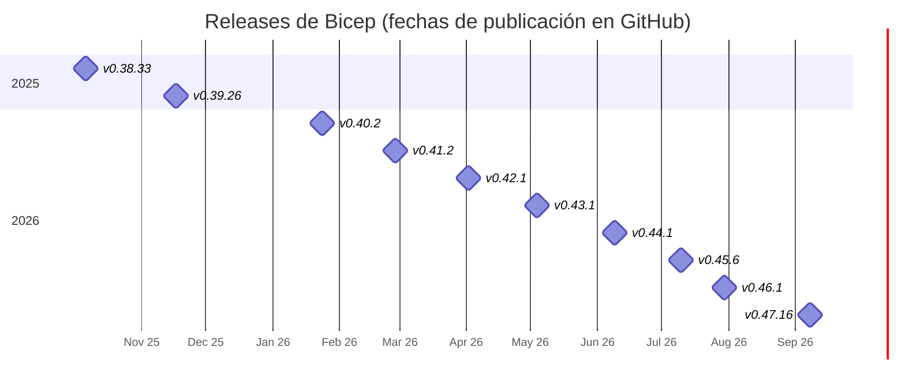
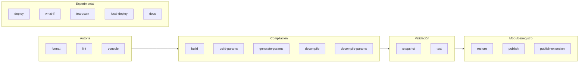

# 04 · Bicep: versiones, novedades y tooling

## 1. Estado actual (1 oct 2026)

| Ítem | Valor |
|------|-------|
| Última versión estable | **v0.47.16** — 8 sep 2026 |
| Cadencia | ~1 release "minor" al mes, más parches |
| Runtime del compilador | .NET 10 (migración en v0.41.2) |
| Licencia | MIT, open source (`github.com/Azure/bicep`) |
| Soporte | Microsoft Support cubre Bicep; **no** cubre features experimentales |
| Requisitos mínimos de herramientas (según feature) | `.bicepparam`: Bicep 0.18.4 / Azure CLI 2.47.0 · Deployment Stacks: Azure CLI 2.61.0 / Az PowerShell 12.0.0 · `--validation-level` en what-if: Azure CLI 2.76.0 |

## 2. Historial de versiones relevantes (oct 2025 → sep 2026)



| Versión | Fecha | Novedades principales |
|---------|-------|-----------------------|
| **v0.47.16** | 8 sep 2026 | `bicep docs generate` (exp.) genera README de módulos con plantillas Scriban · `extends` en `bicepconfig.json` (herencia de configuración) · Playground rediseñado (compilación WASM en web worker) · 5 reglas nuevas de linter para exigir `@description` (apagadas por defecto) · ReadyToRun para arranque más rápido |
| v0.46.1 | 30 jul 2026 | Regla `no-unused-types` · (exp.) valores de *runtime* en `tags` y `sku` (preservar valores existentes al redesplegar) |
| v0.45.15 | 13 jul 2026 | Fix de regresión en exports |
| **v0.45.6** | 10 jul 2026 | **`@retryOn` GA** · (exp.) publicar extensiones a registros OCI no-ACR · Language Server como herramienta NuGet (`dnx -y Azure.Bicep.LangServer`) · parámetros heredados opcionales en `.bicepparam` extendidos · reglas `secure-params-in-parameters-file` y `no-hardcoded-outputs` |
| **v0.44.1** | 9 jun 2026 | **`extends` en `.bicepparam` GA** · **`@nullIfNotFound()` y `this.exists()`/`this.existingResource()` GA** · se elimina el visualizador antiguo (Cytoscape) · CLI migra a `System.CommandLine` |
| v0.43.8 | 7 may 2026 | `retryOn` vuelve temporalmente a experimental mientras se despliega *template language 2.0* en backend · herramientas MCP de build y parámetros |
| v0.43.1 | 4 may 2026 | Funciones `like()` y `distinct()` · regla `use-recognized-resource-type` · **breaking:** bloqueado el uso de dominios personalizados para ACR · mejoras al MCP server (librería `McpServer.Core`) |
| **v0.42.1** | 2 abr 2026 | **`bicep console` GA** (REPL) · función `roleDefinitions('Nombre').id` · Visualizer V2 experimental (exporta PNG) |
| **v0.41.2** | 27 feb 2026 | **`bicep snapshot` GA** · strings multilínea interpolados GA · MCP server con decompile/format/diagnostics y publicado en NuGet · `bicep console` acepta stdin/pipes · migración a .NET 10 |
| v0.40.2 | 24 ene 2026 | Strings multilínea interpolados `$'''...${x}...'''` GA · MCP server distribuido vía `dnx` · pragmas `#disable-diagnostics` / `#restore-diagnostics` multilínea |
| v0.39.26 | 17 nov 2025 | `bicep console` (exp.) con load functions, tipos y funciones · strings multilínea interpolados (exp.) |
| v0.38.33 | 6 oct 2025 | Correcciones (diagnósticos `policyDefinitions` existentes, tipos inline seguros) |

> Fechas tomadas de `github.com/Azure/bicep/releases`. Hitos anteriores relevantes: `.bicepparam` (0.18.4), variables en `.bicepparam` (0.21.x), publicar módulos con código fuente `--with-source` (0.27.1), `using none` (0.31.0).

## 3. Matriz de madurez de features (sep 2026)

| Feature | Estado | Requiere flag |
|---------|--------|---------------|
| User-defined types, `@sealed`, `@discriminator`, nullables | GA | No |
| User-defined functions (`func`) | GA* | No |
| `import` / `export` | GA | No |
| `.bicepparam` + `extends` | GA | No |
| `@retryOn` | GA | No |
| `@nullIfNotFound`, `this.exists()` | GA | No |
| `@onlyIfNotExists` | Disponible (compila sin flag en 0.47.16) | No |
| `resourceInput<>` / `resourceOutput<>` | Disponible | No |
| Strings multilínea interpolados | GA | No |
| `bicep snapshot`, `bicep console` | GA | No |
| Extensión Microsoft Graph | GA (`v1.0:1.0.0`) | No |
| Extensión Kubernetes | Preview | `extensibility` |
| `bicep deploy` / `what-if` / `teardown` desde el CLI de Bicep | Experimental | Sí |
| `bicep local-deploy` | Experimental | Sí |
| `bicep docs generate` | Experimental | Se habilita solo con aviso |
| `bicep test` (aserciones) | Experimental | `testFramework` / `assertions` |
| Runtime values en `tags`/`sku` | Experimental | Sí |
| Publicar extensiones a OCI no-ACR | Experimental | `ociEnabled` |

\* La página "Bicep file structure" de Microsoft Learn aún menciona las UDF como experimentales en su sección de limitaciones, pero compilan sin flag desde hace múltiples versiones. Verifica la página de la feature antes de depender de ella en producción.

## 4. Instalación y actualización

```bash
# Vía Azure CLI (la forma más común)
az bicep install
az bicep upgrade
az bicep version
az bicep list-versions
az config set bicep.use_binary_from_path=true   # usar un bicep instalado manualmente

# Binario standalone (Linux x64)
curl -Lo bicep https://github.com/Azure/bicep/releases/latest/download/bicep-linux-x64
chmod +x ./bicep && sudo mv ./bicep /usr/local/bin/bicep
bicep --version     # Bicep CLI version 0.47.16 (3f73e1a234)

# Windows
winget install -e --id Microsoft.Bicep
# macOS
brew tap azure/bicep && brew install bicep
```

> En CI fija la versión (`bicep-version` en `azure/bicep-deploy@v2`, o `az bicep install --version v0.47.16`) para builds reproducibles.

## 5. Referencia del CLI



| Comando | Uso | Ejemplo |
|---------|-----|---------|
| `build` | Bicep → ARM JSON | `bicep build main.bicep --outdir out/` |
| `build-params` | `.bicepparam` → JSON | `bicep build-params dev.bicepparam --stdout` |
| `generate-params` | Crear archivo de parámetros desde plantilla | `bicep generate-params main.bicep --output-format bicepparam --include-params all` |
| `decompile` | ARM JSON → Bicep (mejor esfuerzo) | `bicep decompile azuredeploy.json` |
| `decompile-params` | JSON params → `.bicepparam` | `bicep decompile-params p.json --bicep-file main.bicep` |
| `format` | Formateo estándar | `bicep format main.bicep` |
| `lint` | Diagnósticos + linter | `bicep lint main.bicep --diagnostics-format sarif` |
| `restore` | Descarga módulos externos a la caché | `bicep restore main.bicep` |
| `publish` | Publica módulo en ACR | `bicep publish st.bicep --target br:miacr.azurecr.io/bicep/st:1.0.0 --with-source` |
| `publish-extension` | (exp.) Publica una extensión | |
| `snapshot` | Genera/valida predicción normalizada de recursos | ver §6 |
| `console` | REPL de expresiones | `bicep console` |
| `test` | (exp.) Ejecuta bloques `test` | `bicep test main.bicep` |
| `jsonrpc` | Interfaz JSON-RPC para integraciones | |
| `deploy` / `what-if` / `teardown` | (exp.) Operaciones de despliegue desde un `.bicepparam` | `bicep what-if dev.bicepparam` |
| `local-deploy` | (exp.) Despliegue local (extensiones locales) | |
| `docs generate` | (exp.) README Markdown del módulo | `bicep docs generate modules/kv.bicep --outfile README.md` |

## 6. `bicep snapshot`: pruebas de regresión de infraestructura sin Azure

`snapshot` evalúa un `.bicepparam` con un contexto simulado (tenant, suscripción, RG, región) y genera un JSON con los **recursos predichos** ya expandidos (nombres resueltos, bucles, condiciones). Se guarda en el repo y en CI se valida.

```bash
# 1. Generar (y commitear) el snapshot
bicep snapshot params/main.dev.bicepparam --mode overwrite \
  --tenant-id 11111111-1111-1111-1111-111111111111 \
  --subscription-id 00000000-0000-0000-0000-000000000000 \
  --location eastus2
# → params/main.dev.snapshot.json

# 2. En cada PR: fallar si el cambio altera la infraestructura predicha
bicep snapshot params/main.dev.bicepparam --mode validate --tenant-id ... --subscription-id ... --location eastus2
```

Salida real al cambiar la retención del workspace de 30 a 60 días en el ejemplo:

```text
Snapshot validation failed. Expected no changes, but found the following:

Scope: /subscriptions/00000000-0000-0000-0000-000000000000/resourceGroups/rg-demo-dev-eastus2

  ~ Microsoft.OperationalInsights/workspaces/log-demo-dev-eastus2
    ~ properties.retentionInDays: 30 => 60
```

Diferencia con what-if: **snapshot no consulta Azure** (determinista, sin credenciales, ideal para PRs de módulos); what-if compara contra el estado real.

## 7. `bicep console`

```text
$ bicep console
> toLower('RG-App')
'rg-app'
> map([1, 2, 3], x => x * 10)
[
  10
  20
  30
]
> like('rg-app-prod', 'rg-*-prod')
true
```

Admite stdin (`echo "uniqueString('a')" | bicep console`), funciones `load*`, tipos y funciones definidas por el usuario.

## 8. `bicepconfig.json`

Se busca desde el directorio del archivo hacia arriba; el más cercano gana. Desde 0.47 admite `extends` para heredar de un config base.

```json
{
  "extends": "../../bicepconfig.base.json",
  "analyzers": {
    "core": {
      "enabled": true,
      "rules": {
        "no-hardcoded-env-urls": { "level": "error" },
        "no-unused-params": { "level": "warning" },
        "no-unused-types": { "level": "warning" },
        "secure-parameter-default": { "level": "error" },
        "outputs-should-not-contain-secrets": { "level": "error" },
        "use-recent-api-versions": { "level": "warning", "maxAllowedAgeInDays": 730 },
        "secure-params-in-parameters-file": { "level": "error" },
        "no-hardcoded-location": { "level": "warning" }
      }
    }
  },
  "moduleAliases": {
    "br": { "corp": { "registry": "crplatformshared.azurecr.io", "modulePath": "bicep/modules" } },
    "ts": { "corpSpecs": { "subscription": "<subId>", "resourceGroup": "rg-templatespecs" } }
  },
  "extensions": {
    "graphV1": "br:mcr.microsoft.com/bicep/extensions/microsoftgraph/v1.0:1.0.0"
  },
  "experimentalFeaturesEnabled": {
    "extensibility": false,
    "testFramework": false,
    "assertions": false
  },
  "cloud": {
    "currentProfile": "AzureCloud",
    "credentialPrecedence": ["AzureCLI", "AzurePowerShell"]
  },
  "formatting": { "indentKind": "Space", "indentSize": 2, "insertFinalNewline": true }
}
```

### 8.1 Reglas de linter más útiles

| Regla | Qué detecta |
|-------|-------------|
| `no-hardcoded-env-urls` | URLs de nube (`core.windows.net`…) en lugar de `environment()` |
| `no-hardcoded-location` | Regiones literales |
| `secure-parameter-default` | Defaults en parámetros `@secure()` |
| `outputs-should-not-contain-secrets` | Secretos en outputs |
| `use-secure-value-for-secure-inputs` | Propiedades sensibles con valores no seguros |
| `secure-params-in-parameters-file` (0.45.6) | Valores literales para params `@secure()` en `.bicepparam` |
| `no-hardcoded-outputs` (0.45.6) | Outputs constantes sin sentido |
| `use-recent-api-versions` | `apiVersion` con más de N días (por defecto 730) |
| `use-recognized-resource-type` (0.43.1) | Tipos desconocidos para Bicep |
| `no-unused-params` / `-vars` / `-types` / `-existing-resources` | Código muerto |
| `use-parent-property` | Nombres de hijos construidos con `/` en vez de `parent` |
| `use-resource-symbol-reference` | `reference()`/`resourceId()` cuando hay símbolo disponible |
| `no-module-name` (0.43.1, opcional) | Fuerza omitir `name` en módulos |

## 9. Editores e IA

| Herramienta | Detalle |
|-------------|---------|
| **VS Code** | Extensión `ms-azuretools.vscode-bicep`: IntelliSense, quick fixes, visualizador, "Deploy Bicep file", insertar recurso existente desde Azure, pegar JSON como Bicep |
| **Visual Studio** | Extensión `ms-azuretools.visualstudiobicep` |
| **Language Server** | También como NuGet: `dnx -y Azure.Bicep.LangServer` (0.45.6) — para Neovim/otros editores LSP |
| **Bicep Playground** | `aka.ms/bicepdemo`: compila Bicep↔JSON en el navegador (WASM) |
| **Bicep MCP Server** | `dnx -y Azure.Bicep.McpServer` (requiere .NET 10 SDK) o integrado en la extensión de VS Code ≥ 0.40.2 |

### 9.1 Herramientas del Bicep MCP Server

| Tool | Función |
|------|---------|
| `get_az_resource_type_schema` | Esquema de un tipo/apiVersion |
| `list_az_resource_types_for_provider` | Tipos de un resource provider |
| `get_bicep_best_practices` | Guía de buenas prácticas |
| `list_avm_metadata` | Catálogo de Azure Verified Modules |
| `get_bicep_file_diagnostics` | Diagnósticos de compilación |
| `format_bicep_file` | Formateo |
| `get_file_references` | Archivos referenciados |
| `decompile_arm_template_file` / `decompile_arm_parameters_file` | ARM JSON → Bicep |
| `get_deployment_snapshot` | Snapshot desde un `.bicepparam` |

Configuración típica (VS Code `mcp.json`, Claude Desktop, etc.):

```json
{
  "servers": {
    "Bicep": { "type": "stdio", "command": "dnx", "args": ["-y", "Azure.Bicep.McpServer"] }
  }
}
```

El MCP **no despliega**: aporta contexto (esquemas, AVM, diagnósticos) al agente. Revisa siempre el código generado.

---
⬅️ [03 · Lenguaje](03-bicep-lenguaje.md) · ➡️ [05 · Módulos, AVM y registros](05-modulos-avm-registros.md)
