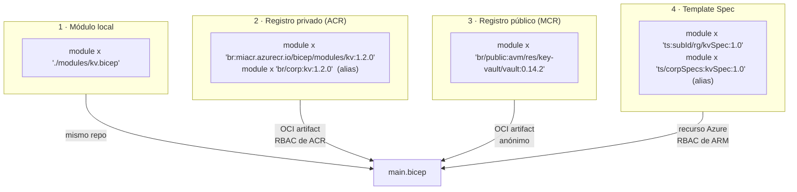
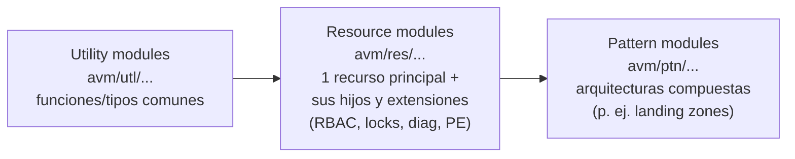
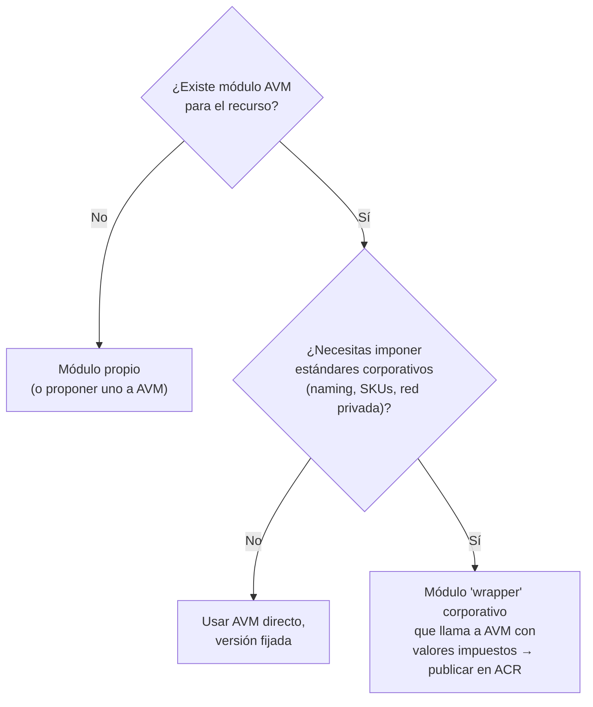

# 05 · Módulos, registros, Template Specs y Azure Verified Modules

## 1. Cuatro formas de compartir código Bicep



| Opción | Dónde vive | Versionado | Control de acceso | Mejor para |
|--------|-----------|-----------|-------------------|------------|
| **Local** | Mismo repo | Git | Repo | Módulos específicos de un workload |
| **ACR privado** (`br:`) | Azure Container Registry | Tags OCI (semver) | Roles de ACR (`AcrPull`/`AcrPush`), Private Link | Biblioteca corporativa de módulos para equipos de ingeniería |
| **MCR público** (`br/public:`) | `mcr.microsoft.com/bicep/...` | Tags semver | Público | Azure Verified Modules |
| **Template Spec** (`ts:`) | Recurso `Microsoft.Resources/templateSpecs` | Versiones del recurso | RBAC de Azure | Compartir con equipos que despliegan desde portal/CLI; reemplazo de definiciones de Blueprints |

## 2. Registro privado en ACR

Requisitos: Bicep ≥ 0.4.1008, Azure CLI ≥ 2.31.0 o Az PowerShell ≥ 7.0.0, rol de push para publicar y pull para consumir.

```bash
# Publicar (incluyendo el código fuente para "Go to definition", Bicep >= 0.27.1)
az bicep publish --file modules/keyvault.bicep \
  --target br:crplatformshared.azurecr.io/bicep/modules/keyvault:1.0.0 \
  --documentation-uri https://wiki.contoso/bicep/keyvault \
  --with-source

# Consumir
#   module kv 'br:crplatformshared.azurecr.io/bicep/modules/keyvault:1.0.0' = { ... }
#   o con alias (bicepconfig.json → moduleAliases.br.corp):
#   module kv 'br/corp:keyvault:1.0.0' = { ... }

# Restaurar / refrescar caché (~/.bicep/br/<registry>/<path>/<tag>)
bicep restore main.bicep --force
```

Recomendaciones:

- **Semver estricto** y tags inmutables (no sobrescribir `1.0.0`; usa `1.0.1`).
- Pipeline de publicación: `lint` → `build` → pruebas (snapshot/what-if contra RG efímero) → `publish` → `bicep docs generate` para el README.
- Para tráfico privado: ACR Premium + **Private Link**. Ojo: desde 0.43.1 **se bloquea el uso de dominios personalizados para ACR** como registro de Bicep.

## 3. Template Specs

```bash
# Crear una versión
az ts create --name kvSpec --version 1.0 \
  --resource-group rg-templatespecs --location eastus2 \
  --template-file modules/keyvault.bicep

# Desplegar directamente una versión
az deployment group create -g rg-app \
  --template-spec "/subscriptions/<sub>/resourceGroups/rg-templatespecs/providers/Microsoft.Resources/templateSpecs/kvSpec/versions/1.0" \
  --parameters keyVaultName=kv-x ...

# Usarla como módulo
#   module kv 'ts:<sub>/rg-templatespecs/kvSpec:1.0' = { params: { ... } }
```

- Es un recurso de Azure: hereda **RBAC**, aparece en el portal y se puede desplegar con UI (incluso con un `uiFormDefinition`).
- Es la pieza que Microsoft propone (junto con Git) para **reemplazar las definiciones de Azure Blueprints**.

## 4. Azure Verified Modules (AVM)

### 4.1 Qué es

Iniciativa de Microsoft que **define el estándar** de lo que es un buen módulo IaC y publica módulos **propiedad de, desarrollados y soportados por Microsoft**, para **Bicep y Terraform**. Consolida iniciativas previas de la comunidad Microsoft (como CARML para Bicep); el código de los módulos Bicep vive en el repositorio `Azure/bicep-registry-modules` y se publica en MCR.

### 4.2 Clasificación



| Tipo | Prefijo | Ejemplo |
|------|---------|---------|
| Resource | `br/public:avm/res/<proveedor>/<tipo>` | `avm/res/storage/storage-account` |
| Pattern | `br/public:avm/ptn/<nombre>` | patrones de landing zone, AKS, etc. |
| Utility | `br/public:avm/utl/<nombre>` | tipos compartidos |

Estado del índice de **módulos de recurso Bicep** (consultado el 1 oct 2026): **170 publicados** (disponibles + huérfanos) y **27 propuestos** (197 en total).

### 4.3 Versiones verificadas en MCR (1 oct 2026)

| Módulo | Última versión |
|--------|----------------|
| `avm/res/storage/storage-account` | **0.33.1** |
| `avm/res/key-vault/vault` | **0.14.2** |
| `avm/res/operational-insights/workspace` | **0.16.1** |
| `avm/res/app/managed-environment` | **0.16.0** |
| `avm/res/app/container-app` | **0.23.0** |

> Puedes consultarlo tú mismo: `https://mcr.microsoft.com/v2/bicep/avm/res/<proveedor>/<tipo>/tags/list`.
> Todos están en **0.x**: según semver, un cambio de *minor* puede romper la interfaz. Fija la versión y lee el CHANGELOG antes de subir.

### 4.4 Interfaces estándar de AVM

Todos los módulos de recurso exponen los mismos parámetros "transversales", lo que hace el código muy uniforme:

| Parámetro | Para qué |
|-----------|---------|
| `name`, `location`, `tags` | Básicos |
| `lock` | `{ kind: 'CanNotDelete' \| 'ReadOnly', name? }` |
| `roleAssignments` | `[{ principalId, roleDefinitionIdOrName, principalType? }]` |
| `diagnosticSettings` | `[{ workspaceResourceId, logCategoriesAndGroups?, metricCategories? }]` |
| `privateEndpoints` | `[{ subnetResourceId, privateDnsZoneGroup? }]` |
| `managedIdentities` | `{ systemAssigned?, userAssignedResourceIds? }` |
| `customerManagedKey` | Cifrado con CMK |
| `enableTelemetry` | Telemetría de uso de AVM (por defecto `true`) |

### 4.5 Ejemplo con AVM

```bicep
module law 'br/public:avm/res/operational-insights/workspace:0.16.1' = {
  params: {
    name: 'log-${workload}-${suffix}'
    location: location
  }
}

module kv 'br/public:avm/res/key-vault/vault:0.14.2' = {
  params: {
    name: take('kv${workload}${suffix}', 24)
    location: location
    enableRbacAuthorization: true
    roleAssignments: [
      {
        principalId: principalId
        roleDefinitionIdOrName: 'Key Vault Secrets User'
        principalType: 'ServicePrincipal'
      }
    ]
    diagnosticSettings: [
      { workspaceResourceId: law.outputs.resourceId }
    ]
  }
}
```

Archivo completo: `ejemplos/bicep-app/main.avm.bicep`.

### 4.6 ¿AVM o módulos propios?



Ventajas de AVM: menos código propio, buenas prácticas WAF incluidas, interfaces homogéneas, soporte de Microsoft.
Costes: abstracción adicional (más difícil de depurar), cambios de interfaz frecuentes en 0.x, JSON compilado más grande (cuidado con el límite de 4 MB en plataformas grandes).

## 5. Landing Zones con Bicep (estado 2026)

| Ítem | Estado |
|------|--------|
| **ALZ-Bicep "clásico"** (`Azure/ALZ-Bicep`) | En deprecación. Fuera del ALZ Accelerator desde el **16 feb 2026**; el repo se **archiva el 16 feb 2027**. Sigue recibiendo fixes de seguridad/policies hasta entonces. |
| **Bicep AVM para Platform Landing Zone** | Opción **por defecto** del ALZ Accelerator. Guía de migración: `aka.ms/alz/acc/bicep`. |
| Terraform | El accelerator también ofrece starter modules de Terraform basados en AVM. |

---
⬅️ [04 · Versiones y tooling](04-bicep-versiones-tooling.md) · ➡️ [06 · Deployment Stacks y gobernanza](06-deployment-stacks-gobernanza.md)
