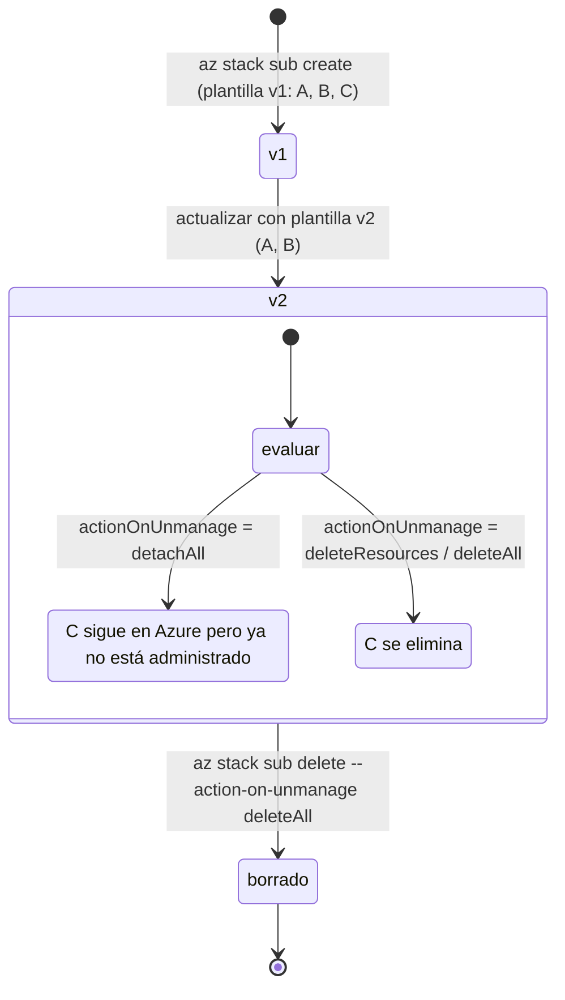
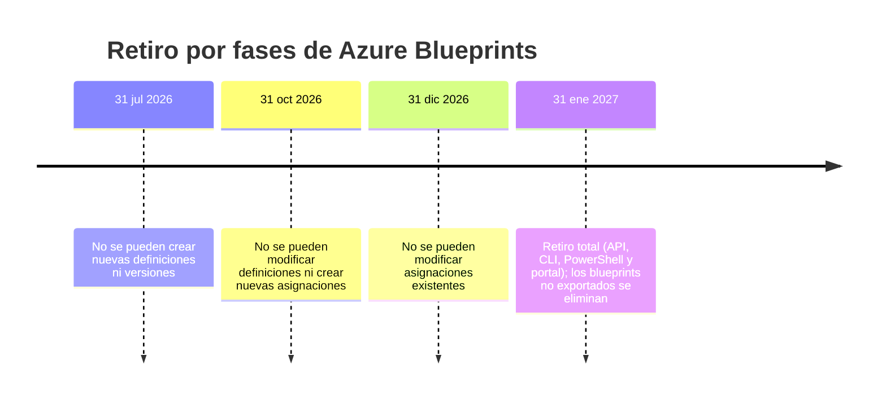
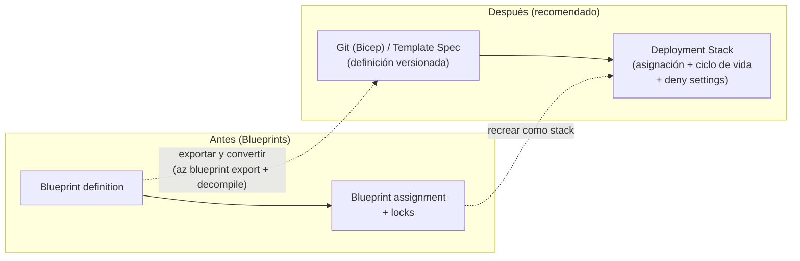
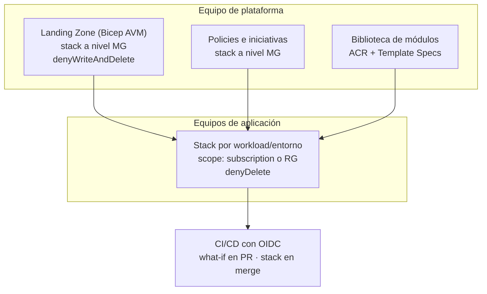

# 06 · Deployment Stacks y gobernanza

## 1. ¿Qué problema resuelven los Deployment Stacks?

Con un deployment "normal" (modo incremental), si quitas un recurso de la plantilla **sigue existiendo** en Azure. El modo *complete* lo borra, pero sólo a nivel RG y con riesgo alto. Además, nada impide que alguien lo modifique a mano.

Un **Deployment Stack** (`Microsoft.Resources/deploymentStacks`, **GA el 23 may 2024**) es un recurso de Azure que:

1. **Recuerda qué recursos administra** (lista de *managed resources*).
2. Al actualizar o borrar el stack, decide qué hacer con lo que salió de la plantilla (**`actionOnUnmanage`**).
3. Opcionalmente protege los recursos con **deny assignments** (**`denySettings`**).
4. Funciona en scope **resource group, subscription y management group**.
5. Acepta **Bicep, ARM JSON y Template Specs**.
6. Desde **ago 2026** tiene **what-if GA** en todas las regiones.



## 2. Parámetros clave

### 2.1 `actionOnUnmanage`

| Valor | Recursos | Resource groups | Management groups |
|-------|----------|-----------------|-------------------|
| `detachAll` | Se desvinculan | Se desvinculan | Se desvinculan |
| `deleteResources` | **Se borran** | Se desvinculan | Se desvinculan |
| `deleteAll` | **Se borran** | **Se borran** (con todo su contenido) | **Se borran** |

> ⚠️ `deleteAll` sobre un RG elimina **todo** lo que haya dentro, aunque no lo haya creado el stack.

### 2.2 `denySettings`

| Modo | Efecto |
|------|--------|
| `none` | Sin protección (por defecto) |
| `denyDelete` | Nadie puede borrar los recursos administrados |
| `denyWriteAndDelete` | Nadie puede modificarlos ni borrarlos (sólo vía el stack) |

| Opción | Límite / detalle |
|--------|------------------|
| `--deny-settings-apply-to-child-scopes` | Extiende la protección a recursos hijos |
| `--deny-settings-excluded-actions` | Hasta **200** acciones excluidas (p. ej. `Microsoft.Compute/virtualMachines/write`) |
| `--deny-settings-excluded-principals` | Hasta **5** principals de Entra excluidos → usa **grupos** |

Limitaciones: sólo **plano de control** (no protege secretos de Key Vault ni blobs), no cubre recursos creados implícitamente (p. ej. VMs del node resource group de AKS).

### 2.3 Roles integrados

| Rol | Permite |
|-----|---------|
| **Azure Deployment Stack Contributor** | Gestionar stacks, **sin** crear/borrar deny assignments |
| **Azure Deployment Stack Owner** | Gestión completa, incluidas deny assignments |

## 3. Comandos (Azure CLI ≥ 2.61.0 / Az PowerShell ≥ 12.0.0)

```bash
# --- Resource group
az stack group create --name stk-app-dev --resource-group rg-app-dev \
  --template-file main.bicep --parameters main.dev.bicepparam \
  --action-on-unmanage deleteResources --deny-settings-mode denyDelete

# --- Subscription (el ejemplo de esta carpeta)
az stack sub create --name stk-demo-dev --location eastus2 \
  --template-file main.bicep --parameters params/main.dev.bicepparam \
  --action-on-unmanage deleteResources \
  --deny-settings-mode denyWriteAndDelete \
  --deny-settings-excluded-principals "<objectId-grupo-breakglass>"

# --- Management group
az stack mg create --name stk-policies --management-group-id mg-landingzones --location eastus2 \
  --template-file policies.bicep --deployment-subscription <subId> \
  --action-on-unmanage detachAll --deny-settings-mode none

# Listar / ver recursos administrados / exportar plantilla
az stack sub list -o table
az stack sub show --name stk-demo-dev --query resources
az stack sub export --name stk-demo-dev

# Borrar
az stack sub delete --name stk-demo-dev --action-on-unmanage deleteAll

# What-if de stacks (GA ago 2026)
az stack-whatif sub create --name wi-demo-dev --location eastus2 \
  --stack-id "/subscriptions/<sub>/providers/Microsoft.Resources/deploymentStacks/stk-demo-dev" \
  --template-file main.bicep --parameters params/main.dev.bicepparam \
  --action-on-unmanage deleteResources --deny-settings-mode denyDelete \
  --retention-interval PT3H
```

El what-if de stacks reporta, además de `Create/Modify/NoChange/Delete`, los tipos **`Detach`**, cambios de **Management Status** (`notManaged → managed`) y **Deny Status**. El resultado se persiste como recurso `Microsoft.Resources/deploymentStacksWhatIfResults` durante el `retention-interval` (ISO 8601: `PT3H`, `P7D`); usa `--with-property-changes true` para ver el detalle por propiedad.

Notas del CLI: `--action-on-unmanage` y `--deny-settings-mode` son **obligatorios** en `az stack * create`; existen además `az stack * validate`, `--validation-level` (`Provider | ProviderNoRbac | Template`) y `--resources-without-delete-support detach|fail` para tipos que no admiten borrado.

Error típico **"stack out of sync"**: la lista de recursos administrados puede no estar al día (cambios fuera del stack). Revisa y reintenta con `--bypass-stack-out-of-sync-error` / `-BypassStackOutOfSyncError`.

## 4. Retiro de Azure Blueprints



> La fecha original era el **11 jul 2026**; Microsoft la extendió al **31 ene 2027** con un retiro por fases. **A la fecha de este documento (1 oct 2026) ya no se pueden crear definiciones nuevas, y en 30 días tampoco nuevas asignaciones.**

### 4.1 Mapeo de capacidades

| Azure Blueprints | Reemplazo |
|------------------|-----------|
| Definición de blueprint (artefactos) | **Template Spec** o **repositorio Git** (Bicep) |
| Versionado de la definición | Versiones de Template Spec / tags de Git |
| Asignación a suscripción / MG | **Deployment Stack** a nivel subscription/MG |
| Resource locks del blueprint | **`denySettings`** del stack |
| Artefactos de policy | Bicep con `Microsoft.Authorization/policyAssignments` dentro del stack |
| Artefactos de RBAC | `Microsoft.Authorization/roleAssignments` en Bicep |



## 5. Azure Policy como complemento

Bicep y Policy se combinan en dos direcciones:

1. **Bicep despliega Policy** (definitions, initiatives, assignments, exemptions) → *policy as code*.
2. **Policy gobierna a Bicep**: los efectos `deny` se evalúan en la **validación preflight**, por lo que un despliegue no conforme falla **antes** de crear recursos; `modify`/`deployIfNotExists` corrigen después.

```bicep
targetScope = 'managementGroup'

resource allowedLocations 'Microsoft.Authorization/policyAssignments@2024-04-01' = {
  name: 'allowed-locations'
  properties: {
    displayName: 'Ubicaciones permitidas'
    policyDefinitionId: tenantResourceId('Microsoft.Authorization/policyDefinitions', 'e56962a6-4747-49cd-b67b-bf8b01975c4c')
    parameters: {
      listOfAllowedLocations: { value: ['eastus2', 'brazilsouth'] }
    }
    enforcementMode: 'Default'
  }
}
```

(`e56962a6-4747-49cd-b67b-bf8b01975c4c` es la definición built-in "Allowed locations".)

## 6. Patrón recomendado de gobernanza



---
⬅️ [05 · Módulos](05-modulos-avm-registros.md) · ➡️ [07 · CI/CD](07-cicd-bicep.md)
