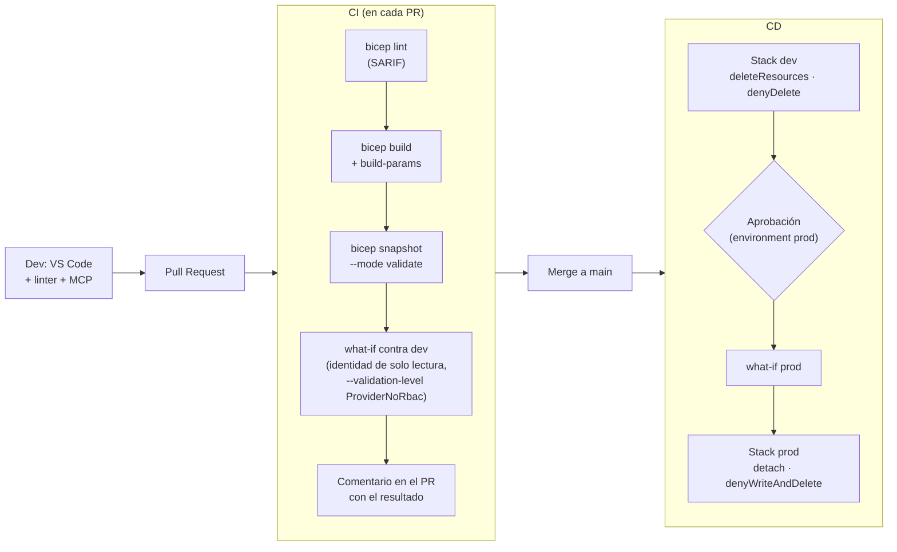
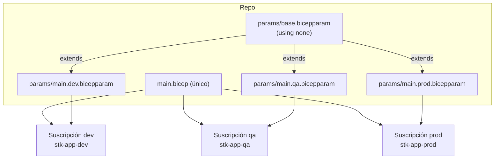

# 07 · CI/CD para Bicep

## 1. Flujo de referencia



## 2. Autenticación: OIDC (workload identity federation)

Sin client secrets: GitHub/Azure DevOps emiten un token OIDC que Entra ID intercambia por un access token.

```bash
# 1. Identidad (UAMI) para el pipeline
az identity create -g rg-cicd -n id-gh-infra
CLIENT_ID=$(az identity show -g rg-cicd -n id-gh-infra --query clientId -o tsv)
PRINCIPAL_ID=$(az identity show -g rg-cicd -n id-gh-infra --query principalId -o tsv)

# 2. Credencial federada por entorno de GitHub
az identity federated-credential create -g rg-cicd --identity-name id-gh-infra \
  --name gh-env-dev --issuer https://token.actions.githubusercontent.com \
  --subject "repo:<org>/<repo>:environment:dev" --audiences api://AzureADTokenExchange

# 3. Permisos mínimos sobre la suscripción
az role assignment create --assignee-object-id $PRINCIPAL_ID --assignee-principal-type ServicePrincipal \
  --role "Contributor" --scope /subscriptions/<subId>
# + "Role Based Access Control Administrator" (idealmente con condición que limite los roles asignables)
#   porque la plantilla crea roleAssignments
# + "Azure Deployment Stack Owner" si el stack gestiona deny assignments
```

Para PRs puedes usar una identidad separada con rol **Reader** y what-if con `--validation-level ProviderNoRbac`.

## 3. GitHub Actions

Acción oficial **`azure/bicep-deploy@v2`** (v2.3.0, 15 abr 2026):

| Input | Valores |
|-------|---------|
| `type` | `deployment` · `deploymentStack` |
| `operation` | deployment: `create`, `validate`, `whatIf` · stack: `create`, `delete`, `validate` |
| `scope` | `tenant`, `managementGroup`, `subscription`, `resourceGroup` (stack sin tenant) |
| `template-file` / `parameters-file` / `parameters` | Bicep/JSON, `.bicepparam`/JSON, inline JSON/YAML |
| `location`, `subscription-id`, `resource-group-name`, `tenant-id` | Según scope |
| `bicep-version` | Fija la versión (por defecto latest) |
| `what-if-exclude-change-types` | Filtra ruido |
| `action-on-unmanage-resources` | `delete` · `detach` |
| `deny-settings-mode` | `denyDelete` · `denyWriteAndDelete` · `none` |
| `masked-outputs` | Oculta outputs sensibles en logs |

Workflow completo listo para usar: `ejemplos/bicep-app/.github/workflows/infra.yml`. Extracto:

```yaml
permissions:
  id-token: write
  contents: read

jobs:
  deploy-dev:
    runs-on: ubuntu-latest
    environment: dev
    steps:
      - uses: actions/checkout@v4
      - uses: azure/login@v2
        with:
          client-id: ${{ secrets.AZURE_CLIENT_ID }}
          tenant-id: ${{ secrets.AZURE_TENANT_ID }}
          subscription-id: ${{ secrets.AZURE_SUBSCRIPTION_ID }}
      - uses: azure/bicep-deploy@v2
        with:
          type: deploymentStack
          operation: create
          name: stk-demo-dev
          scope: subscription
          location: eastus2
          subscription-id: ${{ secrets.AZURE_SUBSCRIPTION_ID }}
          template-file: ejemplos/bicep-app/main.bicep
          parameters-file: ejemplos/bicep-app/params/main.dev.bicepparam
          action-on-unmanage-resources: delete
          deny-settings-mode: denyDelete
```

### 3.1 Linter con anotaciones en el PR (SARIF)

```yaml
      - name: Lint (SARIF)
        run: |
          az bicep install
          az bicep lint --file main.bicep --diagnostics-format sarif > bicep.sarif
      - uses: github/codeql-action/upload-sarif@v3
        with:
          sarif_file: bicep.sarif
```

## 4. Azure Pipelines (Azure DevOps)

```yaml
trigger:
  branches: { include: [main] }
  paths: { include: [infra/*] }

pool:
  vmImage: ubuntu-latest

variables:
  serviceConnection: 'sc-azure-oidc'   # Service connection con Workload Identity Federation
  location: 'eastus2'

stages:
- stage: Validate
  jobs:
  - job: lint_whatif
    steps:
    - task: AzureCLI@2
      displayName: Lint + build
      inputs:
        azureSubscription: $(serviceConnection)
        scriptType: bash
        scriptLocation: inlineScript
        inlineScript: |
          az bicep install
          az bicep lint --file infra/main.bicep
          az bicep build --file infra/main.bicep --stdout > /dev/null
    - task: AzureCLI@2
      displayName: What-if (dev)
      inputs:
        azureSubscription: $(serviceConnection)
        scriptType: bash
        scriptLocation: inlineScript
        inlineScript: |
          az deployment sub what-if \
            --location $(location) \
            --template-file infra/main.bicep \
            --parameters infra/params/main.dev.bicepparam \
            --exclude-change-types NoChange Ignore

- stage: DeployDev
  dependsOn: Validate
  condition: and(succeeded(), eq(variables['Build.SourceBranch'], 'refs/heads/main'))
  jobs:
  - deployment: dev
    environment: dev
    strategy:
      runOnce:
        deploy:
          steps:
          - checkout: self
          - task: AzureCLI@2
            inputs:
              azureSubscription: $(serviceConnection)
              scriptType: bash
              scriptLocation: inlineScript
              inlineScript: |
                az stack sub create --name stk-demo-dev --location $(location) \
                  --template-file infra/main.bicep \
                  --parameters infra/params/main.dev.bicepparam \
                  --action-on-unmanage deleteResources \
                  --deny-settings-mode denyDelete --yes
```

Alternativa: tarea `AzureResourceManagerTemplateDeployment@3`, que acepta archivos `.bicep` directamente. Microsoft destaca que Bicep tiene integración nativa con Azure Pipelines, mientras que Terraform requiere una extensión de terceros.

## 5. Estrategia de entornos



- **Una plantilla, N archivos de parámetros.** Nunca copies plantillas por entorno.
- Separa **suscripciones** por entorno (límites de RBAC y de cuota claros).
- Promoción del **mismo commit**: lo que pasó dev es exactamente lo que va a prod.
- Para pruebas de módulos: despliega a un **RG efímero** (`rg-ci-${{ github.run_id }}`) y bórralo con un stack `deleteAll` al final.

## 6. Pruebas de infraestructura

| Nivel | Herramienta | Requiere Azure |
|-------|-------------|----------------|
| Estático | `bicep lint`, reglas `error` en `bicepconfig.json` | No |
| Compilación | `bicep build`, `build-params` | No |
| Regresión | `bicep snapshot --mode validate` | No |
| Unitario (exp.) | `bicep test` con aserciones | No |
| Política | PSRule for Azure, Checkov, Azure Policy preflight | No / Sí |
| Preflight | `az deployment * validate`, `az stack * validate` | Sí |
| Cambios | `what-if` / `stack-whatif` | Sí |
| Integración | Despliegue a RG efímero + smoke tests | Sí |

---
⬅️ [06 · Deployment Stacks](06-deployment-stacks-gobernanza.md) · ➡️ [08 · Alternativas](08-alternativas-iac-azure.md)
