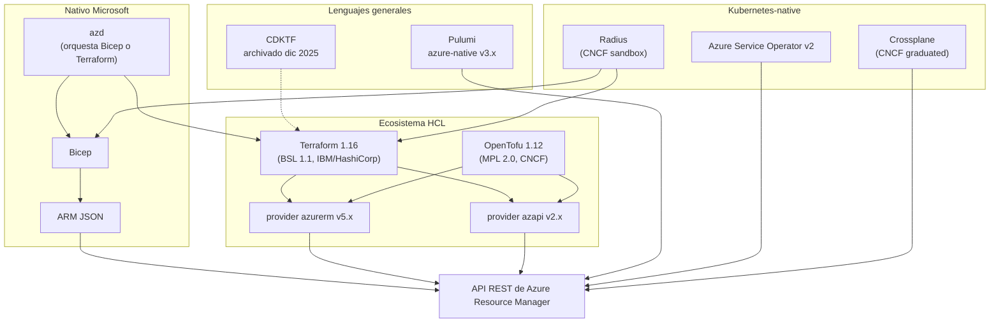
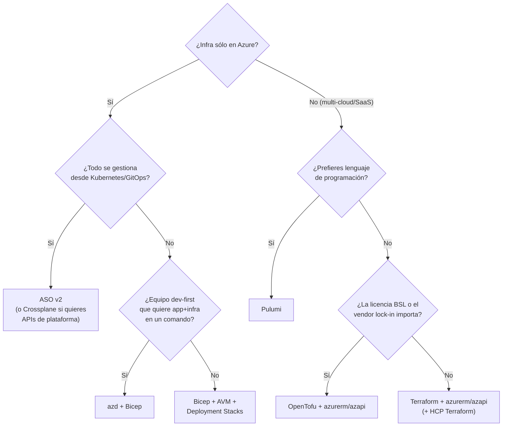

# 08 · Alternativas a Bicep para IaC en Azure

> Versiones verificadas el 1 oct 2026 en los repositorios oficiales de GitHub / registros. Los fragmentos de Terraform, Pulumi, ASO y Radius son **ilustrativos** y no se ejecutaron en el entorno de verificación (sin acceso a sus registros); revisa la documentación de la versión que instales.

## 1. Panorama



## 2. ARM templates (JSON)

- **Qué es:** el formato nativo que entiende ARM. Bicep compila a esto.
- **Cuándo usarlo hoy:** casi nunca para autoría manual. Sigue apareciendo en: plantillas exportadas desde el portal, *Managed Applications* (`mainTemplate.json` + `createUiDefinition.json`), Quickstart templates antiguos, integraciones de terceros.
- **Migración:** `bicep decompile azuredeploy.json` y `bicep decompile-params azuredeploy.parameters.json --bicep-file main.bicep` (resultado "best effort": revisa nombres simbólicos y elimina `dependsOn` redundantes).

## 3. Terraform (HashiCorp / IBM)

### 3.1 Estado actual

| Componente | Versión / dato |
|------------|---------------|
| Terraform CLI | **v1.16.1** (2 sep 2026). v1.16.0 (26 ago 2026) añade el bloque `store` para valores efímeros, import blocks en módulos, etc. v1.17 en alpha. |
| Licencia | **BSL 1.1** desde agosto 2023 (antes MPL 2.0) |
| Propiedad | IBM completó la compra de HashiCorp el **27 feb 2025** (USD 6.4 mil millones) |
| Provider `hashicorp/azurerm` | **v5.5.0** (10 sep 2026). **v5.0.0** major el 27 jul 2026 (elimina campos/recursos deprecados; hay guía de upgrade 5.0). Cadencia semanal. |
| Provider `azure/azapi` | **v2.10.0** (19 may 2026): validación preflight también en updates, sólo requiere permisos de lectura para validar |
| Otros providers Azure | `azuread` (Entra ID), `azuredevops`, `msgraph` |

### 3.2 `azurerm` vs `azapi`

| | `azurerm` | `azapi` |
|-|-----------|---------|
| Modelo | Recursos escritos a mano por HashiCorp/Microsoft (`azurerm_key_vault`) | Envoltura genérica de la API ARM (`azapi_resource` con `type = "...@apiVersion"`) |
| Cobertura de features nuevas | Llega cuando alguien la implementa | **Día 0** (igual que Bicep) |
| Ergonomía | Atributos idiomáticos, validaciones | Cuerpo = JSON/HCL de la API REST |
| Uso típico | Base del código | "Huecos" de `azurerm`, previews, propiedades nuevas (`azapi_update_resource`) |

### 3.3 Ejemplo

```hcl
terraform {
  required_version = ">= 1.9"
  required_providers {
    azurerm = { source = "hashicorp/azurerm", version = "~> 5.5" }
    azapi   = { source = "azure/azapi",       version = "~> 2.10" }
  }
  backend "azurerm" {
    resource_group_name  = "rg-tfstate"
    storage_account_name = "sttfstate001"
    container_name       = "tfstate"
    key                  = "demo-dev.tfstate"
    use_oidc             = true
    use_azuread_auth     = true
  }
}

provider "azurerm" {
  features {}
  subscription_id = var.subscription_id
  use_oidc        = true
}

data "azurerm_client_config" "current" {}

resource "azurerm_resource_group" "rg" {
  name     = "rg-demo-dev-eastus2"
  location = "eastus2"
  tags     = local.tags
}

resource "azurerm_log_analytics_workspace" "law" {
  name                = "log-demo-dev-eastus2"
  location            = azurerm_resource_group.rg.location
  resource_group_name = azurerm_resource_group.rg.name
  sku                 = "PerGB2018"
  retention_in_days   = 30
}

resource "azurerm_key_vault" "kv" {
  name                       = "kvdemodev${random_string.sfx.result}"
  location                   = azurerm_resource_group.rg.location
  resource_group_name        = azurerm_resource_group.rg.name
  tenant_id                  = data.azurerm_client_config.current.tenant_id
  sku_name                   = "standard"
  rbac_authorization_enabled = true   # nombre nuevo (el antiguo enable_rbac_authorization se deprecó en 4.x)
  soft_delete_retention_days = 7
}

# Recurso vía azapi (día 0): Container Apps environment
resource "azapi_resource" "cae" {
  type      = "Microsoft.App/managedEnvironments@2025-01-01"
  name      = "cae-demo-dev-eastus2"
  parent_id = azurerm_resource_group.rg.id
  location  = azurerm_resource_group.rg.location
  body = {
    properties = {
      workloadProfiles = [{ name = "Consumption", workloadProfileType = "Consumption" }]
    }
  }
}
```

Flujo: `terraform init` → `terraform plan -out tfplan` → `terraform apply tfplan`. El **state** (con posibles secretos) debe vivir en un backend remoto con bloqueo (Azure Storage usa *blob lease*), cifrado y RBAC.

Herramientas relacionadas: **Azure Export for Terraform** (`aztfexport`) para importar infraestructura existente; HCP Terraform / Terraform Enterprise, Spacelift, env0, Scalr, Atlantis para orquestación.

## 4. OpenTofu

| Dato | Valor |
|------|-------|
| Origen | Fork de Terraform 1.5.x tras el cambio a BSL (2023), bajo Linux Foundation; proyecto **CNCF** |
| Licencia | MPL 2.0 |
| Versión estable | **v1.12.6** (19 ago 2026); **v1.13.0-beta1** (27 ago 2026) |
| Diferenciadores | **Cifrado del state nativo** (key providers: PBKDF2, AWS KMS, GCP KMS, OpenBao…), evaluación temprana de variables en backends/módulos, `-exclude`, en 1.13: *symbol libraries* (exp.), linting básico (`-lint`, exp.), función `convert`, schemas de providers en el state |
| Compatibilidad Azure | Usa los mismos providers `azurerm`/`azapi` (registro `registry.opentofu.org`) |

Migrar de Terraform ≤ 1.5 suele ser directo (`tofu init` sobre el mismo código/state); desde versiones más nuevas revisa la guía de migración porque las bifurcaciones ya divergieron en features.

## 5. Pulumi

| Dato | Valor |
|------|-------|
| Lenguajes | TypeScript/JavaScript, Python, Go, C#/.NET, Java, YAML |
| Licencia (motor) | Apache 2.0 |
| Provider Azure | **`azure-native` v3.x** (v3 lanzado en 2025; generado desde las specs REST de Azure → cobertura completa y rápida). El provider clásico `azure` (basado en `azurerm`) también existe. |
| Estado | Pulumi Cloud (SaaS) o backends propios (`azblob://`, S3, local) |
| Plus | Tests unitarios con frameworks del lenguaje, Automation API, Pulumi ESC para secretos/config |

```typescript
import * as pulumi from "@pulumi/pulumi";
import * as resources from "@pulumi/azure-native/resources";
import * as keyvault from "@pulumi/azure-native/keyvault";
import * as authorization from "@pulumi/azure-native/authorization";

const cfg = pulumi.output(authorization.getClientConfig());
const rg = new resources.ResourceGroup("rg", { location: "eastus2" });

const kv = new keyvault.Vault("kv", {
  resourceGroupName: rg.name,
  properties: {
    tenantId: cfg.tenantId,
    sku: { family: "A", name: keyvault.SkuName.Standard },
    enableRbacAuthorization: true,
  },
});

export const vaultUri = kv.properties.vaultUri;
```

## 6. CDK for Terraform (CDKTF) — **descontinuado**

HashiCorp/IBM **archivó CDKTF el 10 de diciembre de 2025**; ya no recibe mantenimiento. Existen forks comunitarios (p. ej. "CDK Terrain"), pero para proyectos nuevos en Azure con lenguajes generales la opción natural es **Pulumi**. Si tienes CDKTF en producción: `cdktf synth` genera HCL-JSON que puedes congelar y migrar a HCL.

## 7. Azure Developer CLI (azd)

No es un lenguaje de IaC sino un **orquestador de ciclo de vida app + infra** que usa **Bicep o Terraform** por debajo.

```text
mi-app/
├── azure.yaml          ← definición del proyecto
├── infra/              ← Bicep (main.bicep + main.parameters.json) o Terraform
└── src/api/            ← código
```

```yaml
# azure.yaml
name: demo-app
infra:
  provider: bicep      # o terraform
  path: infra
  module: main
services:
  api:
    project: ./src/api
    language: python
    host: containerapp
```

| Comando | Qué hace |
|---------|----------|
| `azd init -t <template>` | Inicializa desde una plantilla de la galería (p. ej. `hello-azd`) |
| `azd up` | Empaqueta + provisiona + despliega |
| `azd provision` | Sólo infraestructura |
| `azd deploy` | Sólo código |
| `azd down` | Elimina los recursos |
| `azd pipeline config` | Genera CI/CD (GitHub Actions o Azure Pipelines) con credenciales federadas |

Ideal para demos, hackathons, plantillas de referencia de IA (Foundry, OpenAI) y equipos de desarrollo que no quieren escribir pipelines desde cero.

## 8. Radius (CNCF Sandbox desde abril 2024)

Plataforma de aplicaciones open source (originada en Microsoft Azure Incubations) que separa:

- **Desarrolladores:** describen la *aplicación* y sus dependencias (contenedores, bases de datos, colas) de forma agnóstica.
- **Platform engineers:** definen **Recipes** (en **Bicep o Terraform**) que materializan esas dependencias en Azure, AWS o Kubernetes según el entorno.

```bicep
extension radius

@description('ID del environment de Radius (lo inyecta rad deploy)')
param environment string

resource app 'Applications.Core/applications@2023-10-01-preview' = {
  name: 'demo'
  properties: { environment: environment }
}

resource api 'Applications.Core/containers@2023-10-01-preview' = {
  name: 'api'
  properties: {
    application: app.id
    container: { image: 'ghcr.io/org/api:latest', ports: { web: { containerPort: 8080 } } }
    connections: { cache: { source: redis.id } }
  }
}

resource redis 'Applications.Datastores/redisCaches@2023-10-01-preview' = {
  name: 'cache'
  properties: { application: app.id, environment: environment }   // la Recipe decide si es Azure Cache for Redis o un pod
}
```

La documentación actual advierte que hay una **versión preview con nuevos Resource Types** (flag `--preview` / `RADIUS_PREVIEW=true`): espera cambios de API.

## 9. Kubernetes-native: Azure Service Operator v2 y Crossplane

### 9.1 Azure Service Operator (ASO) v2

Operador de Microsoft que expone recursos de Azure como **CRDs** generados desde las especificaciones de ARM (más de 150 tipos: PostgreSQL/MySQL, Redis, Service Bus, Storage, etc.). Reconciliación asíncrona continua y *garbage collection* vía owner references.

```yaml
apiVersion: resources.azure.com/v1api20200601
kind: ResourceGroup
metadata:
  name: rg-demo-aso
  namespace: default
spec:
  location: eastus2
---
apiVersion: storage.azure.com/v1api20230101
kind: StorageAccount
metadata:
  name: stdemoaso001
  namespace: default
spec:
  location: eastus2
  kind: StorageV2
  sku:
    name: Standard_LRS
  owner:
    name: rg-demo-aso
```

### 9.2 Crossplane

Proyecto **CNCF Graduated (6 nov 2025)**. Control plane genérico sobre Kubernetes; para Azure se usa la familia de providers de Upbound (`upbound/provider-family-azure`, línea v2.x; última listada v2.6.1), generados con Upjet desde `azurerm`. Su fuerte son las **Compositions/XRDs** para crear APIs de plataforma propias (p. ej. `kind: Database` que crea servidor + red + secretos).

| | ASO v2 | Crossplane |
|-|--------|-----------|
| Mantenedor | Microsoft | Comunidad CNCF + Upbound |
| Origen de esquemas | Specs ARM | Providers de Terraform (Upjet) |
| Multi-cloud | No | Sí |
| Abstracciones propias | Limitadas | Compositions / Functions |
| Encaja con | AKS + GitOps (Flux/Argo CD), equipos de app | Equipos de plataforma que construyen un "internal cloud API" |

## 10. Comparativa general

| Criterio | Bicep | ARM JSON | Terraform + azurerm/azapi | OpenTofu | Pulumi azure-native | ASO v2 / Crossplane |
|----------|-------|----------|---------------------------|----------|---------------------|---------------------|
| Alcance | Solo Azure (+ Graph, K8s vía extensiones) | Solo Azure | Multi-cloud + SaaS | Multi-cloud + SaaS | Multi-cloud + SaaS | Azure / Multi-cloud |
| Lenguaje | DSL | JSON | HCL | HCL | TS, Py, Go, C#, Java, YAML | YAML (CRDs) |
| Estado | **Sin state** (Azure es la verdad) | Sin state | State file (backend remoto) | State file **cifrable nativamente** | State (Pulumi Cloud o backend propio) | etcd del clúster |
| Soporte día 0 | **Sí** | Sí | `azapi` sí; `azurerm` con retraso | Igual que TF | Sí (generado) | ASO alto (generado); Crossplane depende de azurerm |
| Previsualización | what-if / stack what-if / snapshot | what-if | `plan` (muy preciso) | `plan` | `preview` | `kubectl diff` / dry-run |
| Ciclo de vida / borrado | Deployment Stacks | Modo complete / stacks | Nativo (destroy, state) | Nativo | Nativo | Reconciliación continua |
| Detección de drift | Stacks + what-if (no continuo) | — | `plan`/`refresh` | `plan` | `refresh` | **Continua** |
| Integración Azure Policy | **Preflight** | Preflight | Falla al aplicar | Falla al aplicar | Falla al aplicar | Falla al reconciliar |
| Licencia | MIT | — | **BSL 1.1** (CLI) / MPL (providers) | MPL 2.0 | Apache 2.0 | Apache 2.0 |
| Soporte comercial | Microsoft Support | Microsoft Support | HashiCorp/IBM (HCP/TFE) | Proveedores terceros | Pulumi Corp | Microsoft (ASO) / Upbound |
| Curva de aprendizaje | Baja | Media-alta | Media | Media | Media (si ya programas) | Media-alta (K8s) |



## 11. Coexistencia y migración

- **Bicep + Terraform juntos** es común: plataforma (landing zone) en uno, workloads en otro. Comparten la verdad en Azure, no estado; usa *data sources* / `existing` para leer lo del otro lado. No gestiones el mismo recurso con ambos.
- **ARM JSON → Bicep:** `bicep decompile`.
- **Portal → Bicep:** exportar plantilla (máx. 200 recursos) o en VS Code "Insert Resource" por ID; después `decompile` y limpiar.
- **Terraform → Bicep:** no hay conversión automática oficial; reescribe por módulos usando AVM y elimina los recursos del state (`terraform state rm`) cuando el stack de Bicep los adopte (con `existing` o re-declarándolos con el mismo nombre/ID).
- **Bicep → Terraform:** `terraform import` / bloques `import {}` o `aztfexport` sobre el RG.
- **Blueprints → Bicep + Stacks:** ver [06](06-deployment-stacks-gobernanza.md).

---
⬅️ [07 · CI/CD](07-cicd-bicep.md) · ➡️ [09 · Ejemplo completo](09-ejemplo-completo.md)
