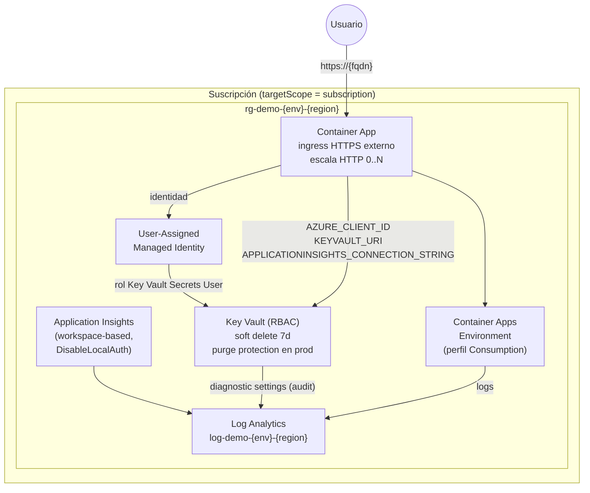
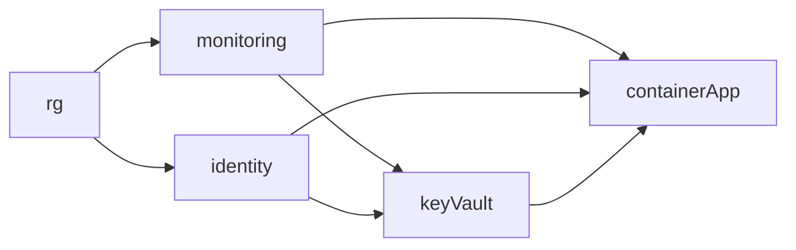
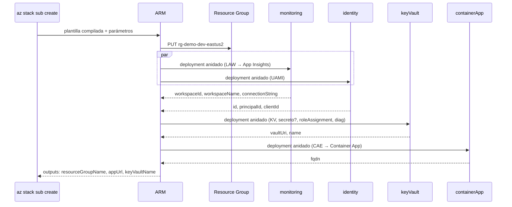

# 09 · Ejemplo completo: app en Azure Container Apps con Bicep

Código en `ejemplos/bicep-app/`. Compila sin errores ni warnings con **Bicep 0.47.16** (`bicep lint main.bicep`, `bicep build main.bicep`, `bicep build-params params/*.bicepparam`).

## 1. Arquitectura desplegada



## 2. Estructura y responsabilidades

| Archivo | Scope | Responsabilidad |
|---------|-------|-----------------|
| `bicepconfig.json` | — | Reglas de linter (secretos = error), alias de registros (`br/corp`, `ts/corpSpecs`), formato |
| `shared/types.bicep` | — | Tipos exportados (`environmentType`, `tagsType` sellado, `containerAppConfigType`) y funciones (`resourceName`, `compactName`) |
| `main.bicep` | subscription | Crea el RG, calcula nombres, orquesta módulos, outputs |
| `modules/monitoring.bicep` | RG | Log Analytics + App Insights |
| `modules/identity.bicep` | RG | UAMI |
| `modules/keyvault.bicep` | RG | Key Vault + secreto condicional + role assignment + diagnostic settings |
| `modules/containerapp.bicep` | RG | Environment + Container App |
| `params/base.bicepparam` | — | `using none`: valores comunes |
| `params/main.dev.bicepparam` / `main.prod.bicepparam` | — | `extends` base + overrides por entorno |
| `params/main.dev.snapshot.json` | — | Snapshot de recursos predichos (regresión) |
| `main.avm.bicep` | RG | Variante con Azure Verified Modules |
| `.github/workflows/infra.yml` | — | CI/CD: lint → what-if → stack dev → stack prod |

## 3. Grafo de dependencias (calculado por Bicep)



Extraído del ARM JSON compilado (`dependsOn`):

| Deployment | dependsOn |
|-----------|-----------|
| `monitoring` | `rg` |
| `identity` | `rg` |
| `keyVault` | `identity`, `monitoring`, `rg` |
| `containerApp` | `identity`, `keyVault`, `monitoring`, `rg` |

`monitoring` e `identity` se despliegan **en paralelo**.

## 4. Recorrido por el código

### 4.1 Tipos y funciones compartidas — `shared/types.bicep`

```bicep
@export()
type environmentType = 'dev' | 'qa' | 'prod'

@export()
@sealed()
type tagsType = {
  environment: environmentType
  owner: string
  costCenter: string
  project: string
}

@export()
func resourceName(abbreviation string, workload string, env environmentType, location string) string =>
  toLower('${abbreviation}-${workload}-${env}-${location}')
```

Por qué: los tags obligatorios se validan **en compilación** (si falta `costCenter` o hay una clave extra, el build falla), y el naming queda centralizado.

### 4.2 Orquestador — `main.bicep`

```bicep
targetScope = 'subscription'
import { environmentType, tagsType, containerAppConfigType, resourceName, compactName } from 'shared/types.bicep'

param workload string
param environment environmentType
param location string = deployment().location
param tags tagsType
param appConfig containerAppConfigType
param enablePurgeProtection bool = environment == 'prod'

var names = {
  rg: resourceName('rg', workload, environment, shortLocation)
  kv: compactName('kv', workload, environment, subscription().subscriptionId)
  // ...
}

resource rg 'Microsoft.Resources/resourceGroups@2025-04-01' = { name: names.rg, location: location, tags: tags }

module keyVault 'modules/keyvault.bicep' = {
  scope: rg
  params: {
    readerPrincipalId: identity.outputs.principalId   // dependencia implícita
    workspaceId: monitoring.outputs.workspaceId
    // ...
  }
}
```

Puntos clave: `deployment().location` (en scope subscription la región se pasa con `-l`), módulos con `scope: rg`, nada de `dependsOn` manual.

### 4.3 Key Vault con RBAC — `modules/keyvault.bicep`

```bicep
resource kv 'Microsoft.KeyVault/vaults@2024-11-01' = {
  name: keyVaultName
  location: location
  properties: {
    enableRbacAuthorization: true
    enableSoftDelete: true
    softDeleteRetentionInDays: 7
    enablePurgeProtection: enablePurgeProtection ? true : null   // no admite 'false' explícito una vez activado
    // ...
  }
}

resource kvSecretsUser 'Microsoft.Authorization/roleAssignments@2022-04-01' = {
  name: guid(kv.id, readerPrincipalId, 'Key Vault Secrets User')
  scope: kv
  properties: {
    roleDefinitionId: roleDefinitions('Key Vault Secrets User').id
    principalId: readerPrincipalId
    principalType: 'ServicePrincipal'   // evita errores de replicación de Entra ID
  }
}
```

### 4.4 Container App — `modules/containerapp.bicep`

```bicep
resource law 'Microsoft.OperationalInsights/workspaces@2025-07-01' existing = { name: workspaceName }

resource cae 'Microsoft.App/managedEnvironments@2025-01-01' = {
  properties: {
    appLogsConfiguration: {
      destination: 'log-analytics'
      logAnalyticsConfiguration: {
        customerId: law.properties.customerId
        sharedKey: law.listKeys().primarySharedKey
      }
    }
    workloadProfiles: [ { name: 'Consumption', workloadProfileType: 'Consumption' } ]
  }
}

var extraEnv = [for item in items(config.?env ?? {}): { name: item.key, value: item.value }]
// env: [...baseEnv, ...extraEnv]
```

Muestra: `existing`, `listKeys()`, safe-dereference `.?`, coalesce `??`, bucles sobre `items()` y spread de arrays.

### 4.5 Parámetros por entorno

```bicep
// params/main.prod.bicepparam
using '../main.bicep'
extends 'base.bicepparam'

param environment = 'prod'
param tags = { environment: 'prod', owner: 'keniding', costCenter: 'CC-0001', project: 'iac-bicep-demo' }
param appConfig = {
  image: 'mcr.microsoft.com/k8se/quickstart:latest'
  minReplicas: 2
  maxReplicas: 10
  cpu: '0.5'
  memory: '1.0Gi'
  targetPort: 80
  env: { LOG_LEVEL: 'Warning' }
}
```

## 5. Cómo ejecutarlo

```bash
cd ejemplos/bicep-app

# 0. Validación local (sin Azure)
az bicep lint --file main.bicep
az bicep build --file main.bicep --stdout > /dev/null
bicep snapshot params/main.dev.bicepparam --mode validate \
  --tenant-id 11111111-1111-1111-1111-111111111111 \
  --subscription-id 00000000-0000-0000-0000-000000000000 --location eastus2

# 1. Login
az login
az account set --subscription <subId>

# 2. What-if
az deployment sub what-if -l eastus2 -f main.bicep -p params/main.dev.bicepparam

# 3a. Deployment clásico
az deployment sub create -n demo-dev -l eastus2 -f main.bicep -p params/main.dev.bicepparam

# 3b. (Recomendado) Deployment stack
az stack sub create -n stk-demo-dev -l eastus2 -f main.bicep -p params/main.dev.bicepparam \
  --action-on-unmanage deleteResources --deny-settings-mode denyDelete

# 4. Outputs
az stack sub show -n stk-demo-dev --query outputs

# 5. Limpieza total
az stack sub delete -n stk-demo-dev --action-on-unmanage deleteAll --yes
```

> El snapshot incluido se generó con tenant/suscripción ficticios (los de arriba); si cambias esos valores, regenéralo con `--mode overwrite`.

## 6. Secuencia de despliegue



## 7. Ejercicios sugeridos

1. Agregar `@retryOn(['PrincipalNotFound'], 3)` al role assignment si la identidad tarda en replicar.
2. Reemplazar `modules/keyvault.bicep` por `br/public:avm/res/key-vault/vault:0.14.2` (ver `main.avm.bicep`).
3. Añadir private endpoints y `publicNetworkAccess: 'Disabled'` para prod.
4. Publicar `modules/keyvault.bicep` en tu ACR con `--with-source` y consumirlo con el alias `br/corp`.
5. Generar documentación: `bicep docs generate modules/keyvault.bicep --outfile modules/keyvault.md` (experimental).

---
⬅️ [08 · Alternativas](08-alternativas-iac-azure.md) · ➡️ [10 · Buenas prácticas](10-buenas-practicas-antipatrones.md)
