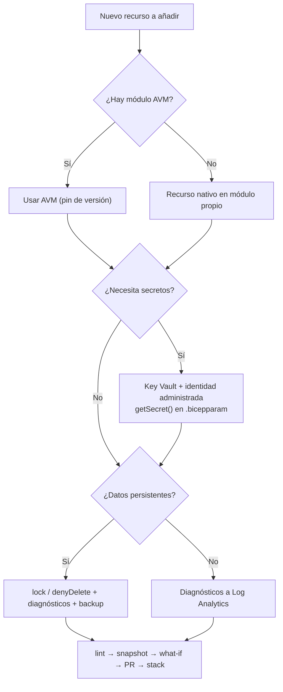

# 10 · Buenas prácticas, anti-patrones y troubleshooting

## 1. Checklist de buenas prácticas

### Diseño y estructura
- [ ] **Una plantilla, varios `.bicepparam`** (uno por entorno) con `extends` desde un `base.bicepparam`.
- [ ] `main.bicep` orquesta; la lógica vive en **módulos pequeños** con una responsabilidad.
- [ ] Prefiere **AVM** o un *wrapper* corporativo sobre AVM antes que escribir módulos desde cero.
- [ ] Tipos compartidos (`@export()`) para tags, naming y objetos de configuración; usa **`@sealed()`** en objetos críticos.
- [ ] Parámetros como **objetos tipados** en lugar de decenas de parámetros sueltos (límite: 256).
- [ ] `location` como parámetro con default (`resourceGroup().location` / `deployment().location`), nunca literal.
- [ ] Nombres deterministas: `uniqueString(<scope>.id)` y `guid(...)` para role assignments.
- [ ] Declara `targetScope` explícitamente cuando no sea `resourceGroup`.

### Seguridad
- [ ] `@secure()` en todo secreto; **nunca** en outputs (o usa `@secure()` también en el output).
- [ ] Secretos desde Key Vault con `getSecret()` en `.bicepparam`; Key Vault con `enabledForTemplateDeployment`.
- [ ] Prefiere **identidades administradas + RBAC** a claves/cadenas de conexión (`DisableLocalAuth`, `enableRbacAuthorization`).
- [ ] `principalType` explícito en role assignments.
- [ ] CI/CD con **OIDC**; identidades distintas para PR (lectura) y despliegue (escritura).
- [ ] Deployment Stacks con **`denyDelete`** como mínimo en prod; excluye a un **grupo** de break-glass.

### Calidad
- [ ] `bicepconfig.json` versionado con reglas de seguridad en **`error`**.
- [ ] `bicep lint` + `build` + `snapshot --mode validate` en cada PR.
- [ ] What-if obligatorio antes de prod, revisado por humanos.
- [ ] `apiVersion` recientes (regla `use-recent-api-versions`) pero **fijadas**: actualiza deliberadamente.
- [ ] Versiones fijadas de: Bicep CLI en CI, módulos AVM/ACR, extensiones.
- [ ] `@description()` en parámetros/outputs de módulos (y `bicep docs generate` para el README).

### Operación
- [ ] Usa **Deployment Stacks** en lugar de modo *complete*.
- [ ] Nombres de deployment únicos por ejecución (`demo-${run_number}`) para conservar historial útil.
- [ ] Tags obligatorios (owner, costCenter, environment) reforzados además con **Azure Policy**.
- [ ] Locks/deny settings en recursos con datos (bases de datos, Key Vault, Storage).

## 2. Anti-patrones

| Anti-patrón | Por qué es malo | Alternativa |
|-------------|-----------------|-------------|
| `dependsOn` manual en todo | Ruido, errores, Bicep ya lo infiere | Referencias simbólicas (`x.id`, `mod.outputs.y`) |
| Construir IDs con `concat`/`format` | Frágil, ignora scopes | `resource ... existing` + `.id` o `resourceId()` |
| Nombres de hijos con `'padre/hijo'` | Difícil de leer, regla `use-parent-property` | `parent: kv` o recursos anidados |
| Plantilla por entorno (`main-dev.bicep`, `main-prod.bicep`) | Divergencia | Un `main.bicep` + parámetros |
| Secretos en `.bicepparam` o en outputs | Quedan en Git / historial de deployments | `getSecret()`, `@secure()`, Key Vault references |
| Modo *complete* para "limpiar" | Borrados accidentales, sólo RG | Deployment Stacks con `deleteResources` |
| Mezclar portal + IaC sobre el mismo recurso | Drift; el siguiente deploy "pisa" el cambio | Todo por código; `denyWriteAndDelete` |
| Gestionar un recurso con Bicep **y** Terraform | Pelea de estado | Un dueño por recurso; el otro usa `existing`/data source |
| Depender de features experimentales en prod | Sin soporte de Microsoft, pueden cambiar | Esperar GA o aislar en entornos no productivos |
| Módulos AVM sin versión fijada / sin leer CHANGELOG | 0.x rompe interfaces | Pin + Dependabot/Renovate + PR revisado |
| `utcNow()`/`newGuid()` en nombres | No idempotente: crea recursos nuevos en cada deploy | `uniqueString()` con semillas estables |
| Monolito de 800 recursos | Límites de ARM (800 recursos, 4 MB) | Dividir por capas/stacks |

## 3. Errores frecuentes y cómo resolverlos

| Error / síntoma | Causa típica | Solución |
|-----------------|-------------|----------|
| `BCP081: Resource type ... does not have types available` | `apiVersion` desconocida por tu versión de Bicep | Actualiza Bicep o confirma la versión; compila igual |
| `BCP318: value may be null` | Acceso a recurso/propiedad que puede ser `null` | Usa `.?` y `??` |
| `PrincipalNotFound` en role assignment | La identidad recién creada no ha replicado en Entra ID | `principalType: 'ServicePrincipal'`; `@retryOn(['PrincipalNotFound'], 3)` |
| `RequestDisallowedByPolicy` | Azure Policy con efecto `deny` (preflight) | Ajusta la plantilla o pide una exemption |
| `MissingSubscriptionRegistration` | Resource provider no registrado | `az provider register -n Microsoft.App` |
| `InvalidTemplateDeployment` + `DeploymentQuotaExceeded` | Historial > 800 | ARM purga automáticamente; si persiste, borra deployments antiguos |
| `Conflict` / `AnotherOperationInProgress` | Operación concurrente sobre el recurso | `@batchSize(1)`, `@retryOn(['Conflict'], n)` o serializar módulos |
| Key Vault "already exists in soft-deleted state" | Nombre usado por un vault borrado | `az keyvault recover` o purge (si no hay purge protection) |
| What-if muestra cambios que no ocurren | Ruido de propiedades por defecto | Usa `--exclude-change-types`, revisa sólo `Create/Delete/Modify` relevantes |
| "Deployment stack out of sync" | Cambios fuera del stack | Revisar recursos y `--bypass-stack-out-of-sync-error` |
| `JobSizeExceeded` / plantilla > 4 MB | Plantilla compilada demasiado grande (módulos inline, `load*`) | Dividir; usar registros (`br:`) o Template Specs; reducir contenido embebido |

## 4. Matriz de decisión rápida para el día a día

---
⬅️ [09 · Ejemplo completo](09-ejemplo-completo.md) · ➡️ [11 · Fuentes](11-fuentes.md)
